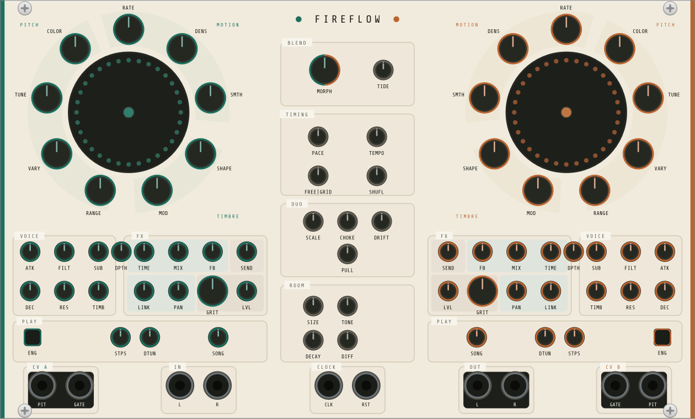
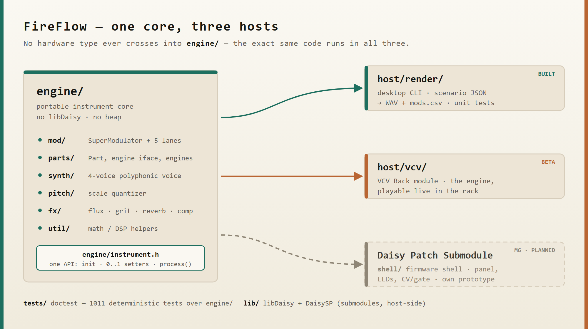

<p align="center">
  
</p>

# FireFlow — a modulation-first ambient groovebox

A digital instrument built around a single idea: **modulation is the
instrument**. Two symmetric parts, each driven by a performable modulation
engine, feeding a selectable sound source.

It runs today on the desktop and inside VCV Rack. The hardware target is a
**standalone Daisy Patch Submodule prototype**, brought up in milestone M6.

**Build log, audio demos and photos:** [fireflow.ton-k.de](https://fireflow.ton-k.de/)

> **⚠️ Not yet running on hardware.** The modulation engine currently exists
> only as a portable C++ core, verified with the desktop **offline renderer**
> (unit tests + audio/CV render) and playable through the VCV Rack host.
> Selected CPU workloads have been measured on a real Daisy Seed; the firmware
> shell that turns the engine into a playable device is milestone M6, and it has
> not been built.

## What makes it different

The **modulation system is the primary interface**, and the sound engine is
whatever you point it at — not a sound engine you happen to be able to
modulate.

Each part currently points at one of five: a **polyphonic synth voice**, a
**granular texture deck** that granulates live input or a loaded sample,
**WAVE**, a digital-glassy PPG-style wavetable voice, **BODY**, a resonator
that morphs along a physical axis from plucked string through prepared piano to
struck bell, or **BBD**, a voiceless bucket-brigade delay that processes
whatever reaches it — audio input or the other deck — instead of playing
notes. The deck is deliberately not a second melodic instrument — it
is the room the synth part plays in; WAVE covers the bell, vocal-formant,
hollow-resonant, and bright-digital corner; BODY is the struck and bowed one,
and it can be excited by its own echo, by the other deck, or by the audio
input; BBD is the one deck with nothing to trigger — it has no notes, so its
five modulation lanes drive the delay's clock, feedback and mix instead of
pitch and timbre, and its own voice row retunes ATTACK/DECAY/RESONANCE/SUB/
FILT into the delay's freeze, tail, feedback tilt, input level and loss-pole
brightness. All five sit behind the same five modulation lanes and the same
voice row, so no knob goes dead when you flip the engine.

That voice-row **SOURCE** control is contextual — **TIMB** on Synth, **FRAME**
on WAVE, **MATL** on BODY, **ORG** on Sampler, and **DRIVE** on BBD — while
**Detune A/B** remains an independent per-part setting.

On the texture deck, **STEP** walks a `SliceMap` of transients marked while the
buffer is recorded or loaded: each phrase fire spawns one grain on a real
attack in the material. MOTION moves that walk from ordered playback at zero
toward free traversal. **DENS** controls runtime grain overlap; **COLOR**
becomes **FEEL** in STEP, deriving accents from the material, and spreads the
cloud's pitch in FLOW. Material without enough transients falls back to the
even tempo grid automatically, so drones and pads stay playable. FLOW still
moves continuously across the same lanes regardless of engine.

Melodic **STEP** lanes keep two persistent full-pattern snapshots, A and B.
**FORM** chooses how those phrases are composed — TWO MOTIFS, ONE + VAR,
HIERARCHICAL, CALL / RESPONSE, or OSTINATO — while **SONG** independently
arranges them as AAAB, ABAB, ABBB, BUILD, ROTATE, MIRROR, or OFF. Structural
changes land on phrase boundaries; OFF keeps A evolving while B remains stored.
On the Rack panel the PLAY row is **STEP · FORM · SONG · NEW**. NEW rebuilds
the A/B pair and, on a Sampler, also spawns a grain immediately.

Each of the two **parts** is a **SuperModulator** — one performable macro
surface (RATE, SHAPE, DENSITY, SMOOTH, RANGE, MOD) sitting on top of
**five independent modulation lanes**, one per target. Every lane has its own
phase, its own random stream and its own probability dice, running at a fixed
musical ratio of the master rate. Shared character, independent motion: the
melody can rise while the filter falls. (A single output driving all targets
would just move everything in unison — a tremolo, not an instrument.)

Each lane can run as a smooth LFO (**FLOW**), a stepped sequence (**STEP**), or
grow, loop, or erode over time (**ENTROPY**). A center section -- **MORPH / COUPLE / DRIFT / SPOT / SETTLE** -- makes the
interaction between the two parts playable. One shared **Oliverb**-based
ambient reverb turns the room into an instrument (Doppler SIZE and a DECAY that
blooms past 100 %), while each deck has its own **SEND** dry/send mix into that
shared room (the centre **ROOM** group holds the reverb itself). CV + gate
outputs extend the modulation to the rest of the rack.

The full design intent lives in
[`docs/superpowers/specs/`](docs/superpowers/specs/); this README is a
self-contained summary of it.

## Architecture at a glance

One portable engine core, three hosts. No hardware type ever crosses into
`engine/`, so the exact same code runs in the desktop renderer, the VCV Rack
module, and (later) on the hardware prototype.

<p align="center">
  
</p>

`Instrument` (`engine/instrument.h`) is the complete public API: `init(sample_rate)`,
normalized `0..1` parameter setters, and `process(in, out, size)`.

## Try it on the desktop (no hardware)

The engine is fully testable offline. You need a host C++ toolchain
(**clang** or gcc), **CMake**, and **Ninja**. doctest and nlohmann/json are
vendored under `third_party/`, so no test dependencies are fetched.

```bash
# optional: source a local env.sh to put your toolchain on PATH and set CC/CXX
source env.sh

cmake -S . -B build -DCMAKE_BUILD_TYPE=Release
cmake --build build
```

Run the unit tests:

```bash
ctest --test-dir build --output-on-failure
```

Configure with `-DCMAKE_BUILD_TYPE=Release`. Two of the four tests (`spky_tests`
and `ctrl_identity`) compare rendered audio against stored SHA-256 references,
and those were generated from an optimised build — a Debug configuration renders
slightly different floats and fails them with `SYNTH reference moved`.

Render a scenario to audio + a modulation trace. A scenario is a JSON timeline
of parameter changes (see `host/render/scenarios/`):

```bash
./build/render.exe host/render/scenarios/demo_step_melody.json out.wav mods.csv
```

This writes:

- **`out.wav`** — the rendered audio.
- **`mods.csv`** — every lane's output plus pitch CV / gate per part, decimated
  for plotting. Ideal for *seeing* what FLOW / STEP / MELODY actually do.

`demo_step_melody` is a good starting point: a fixed 16-step melody that loops
identically, then varies (GROW) or regenerates into new motivic phrases (RENEW)
as MELODY is dialled off center — and cycles the phrase principle.

## Play it now — VCV Rack (beta)

For a hands-on feel of the concept there's a **VCV Rack plugin** (`host/vcv/`)
that runs the same engine live — turn the knobs and hear the modulation engine
long before the M6 firmware. It's now a **beta**: real, playable Rack modules and
a permanent part of the workflow, not yet a finished instrument.

The plugin ships **two modules over the one engine core**. **FireFlow** is the
full surface: every engine setter on its own knob. **FireFlow Glow** (new in
3.0.0, itself at **0.1**) is the flow-machine view — 12 HP, six macro knobs and
one NEW button over a seeded generative terrain, driving `engine/flow/` instead
of the one-control-per-parameter panel. Same core, two ways to play it; details
in [`host/vcv/README.md`](host/vcv/README.md).

You can also just listen first: the [build log](https://fireflow.ton-k.de/)
carries recordings from most milestones, next to the story of how they came
about.

**[Download the latest release](https://github.com/mcbronkowitch/fireflow/releases/latest)**
— `.vcvplugin` builds for Windows, Apple Silicon and Linux, currently **3.0.0**
(both modules: Synth, Sampler, WAVE, BODY and BBD, the independent FORM/SONG
phrase arranger and the STEP mod grid lock — plus Glow 0.1). Unpack into Rack's
user plugin directory and restart Rack.

Building it yourself needs its own toolchain (a native MinGW/GCC compiler, not
the desktop clang path); the build, install and I/O details live in
[`host/vcv/README.md`](host/vcv/README.md).

## Roadmap

| Milestone | Scope | Status |
|-----------|-------|--------|
| **M1** | Portable engine foundation: SuperModulator, five lanes, `Instrument` API, desktop render host + tests | ✅ done |
| **M1.6** | FX: per-part FLUX (tape echo) + GRIT (drive/reduce), shared ambient reverb, FX params as modulation targets | **done** (engine + host) |
| **M2** | Polyphonic synth voice (replaces the M1 test tone) | **done** (engine + host) |
| **M3** | Capture sequencer (freeze the PITCH lane into a loop) | **done** (engine + host) |
| **M4** | Center section — MORPH / COUPLE / DRIFT / SPOT / SETTLE | **done** (engine + host) |
| **M4.5** | Ambient reverb v2 — Oliverb port: Doppler SIZE, DECAY > 100 % bloom, TONE; shimmer & LGPL removed | **done** (engine + host) |
| **M4.6** | Dynamics — one-knob comp per part + master limiter w/ master drive (captioned **PUSH** on the panel) | **done** (engine + host) |
| **M4.8** | Reverb dry/wet — equal-power MIX at the master join + clear-on-sleep CPU bypass | **done** (engine + host) |
| **M4.9** | Reverb DIFFUSION knob (replaces DEPTH) — room density 0–0.9, weak line-mod coupling | **done** (engine + host) |
| **M4.10** | Chord layer — COLOR knob, diatonic stacks, voice-leading, live FLOW surface | **done** (engine + hosts; hardware placement deferred) |
| **M5** | Sampler -- the texture deck: granular cloud, live recording + overdub, WAV load/save, Morphagene-style DENS/SCAN/NEW/LEN/ORG controls, clocked slice-groove, FEEL accents, and FLOW cloud dispersion | **done** (engine + hosts; released through 2.11.0) |
| **M5h** | Per-deck **SEND** mix: independent dry/send mix per deck into one shared Oliverb reverb | **done** (engine + VCV panel; released in 2.11.0) |
| **CPU** | Three measured rounds on real hardware: `instrument_worst`'s worst block went from ~156 % of the audio-block budget to 94 %, and back up to 102 % when M5j's tape tap landed (measured at 5.4 % of the block). FLUX's bucket-brigade redesign (below) is done; a fresh hardware measurement of the redesigned block (`instrument_worst_bbd`, its row added to the `system` profile by `bench/workloads_system.cpp`, alongside an isolated `bbd` bench family in `bench/workloads_bbd.cpp`) is built but not yet run — outstanding, needs a Daisy Seed + ST-Link. Method and every number in [`bench/`](bench/README.md) and [`docs/bench/`](docs/bench/) | **done** (ongoing as a tool) |
| **M5i** | WAVE: four-voice PPG-style wavetable part engine | **done** (engine + renderer + VCV; 65,024-byte mapped-QSPI bank; hardware-gated; released in 2.13.0) |
| **+ FORM/SONG** | Persistent A/B phrase snapshots: five FORM phrase engines plus AAAB, ABAB, ABBB, BUILD, ROTATE, MIRROR, and OFF SONG arrangements; boundary-safe changes and legacy patch migration | **done** (engine + renderer + VCV; released in 2.13.1) |
| **M5j** | BODY: one-voice-per-deck resonator part engine, morphing string -> metal -> bell, with a sympathetic excitation bus | **done** (engine + renderer + VCV; hardware-gated: `body_2x4` 295078 cycles, 30.7 % of the block, inside the spec's 29-32 % prediction and cheaper than SYNTH) |
| **FLUX -> BBD** | FLUX's interpolating tape echo replaced by a bucket-brigade delay model: the clock rate *is* the delay time, so RATE bends stored pitch, and `FXT_FLUX_TIME` is a genuine chorus/vibrato modulation lane (STAGES has since moved off FLUX onto the BBD deck's own pitch lane, captioned **BEND** on the panel) | **done** (engine + renderer + VCV; RATE/STAGES/`FXT_FLUX_TIME` confirmed by ear, DRIVE diagnosed and fixed but awaiting re-listening; hardware CPU measurement outstanding) |
| **M5k** | ZAP: monophonic percussion part engine | planned (spec ready; not implemented) |
| **M5l** | PULL: chord gravity between the two decks | planned (spec ready; not implemented) |
| **M6** | Hardware prototype: bring-up on a Daisy Patch Submodule — panel, controls, LEDs, CV/gate I/O, preset persistence | planned after M5l (**needs a new hardware/panel spec**; the existing shell spec assumes Spotykach's panel) |

Per-milestone detail and current status live in [`docs/roadmap.md`](docs/roadmap.md).

## Hardware prototype (M6)

The instrument's own hardware is a **standalone Daisy Patch Submodule**
prototype — panel, controls, LEDs, CV/gate I/O and preset persistence — planned
as milestone **M6**, after the two remaining engine milestones. Nothing of it is
built yet, and its panel still has to be designed: the existing firmware-shell
spec was written against a different device and no longer describes the target.

CPU headroom on the target MCU is not guesswork, though. Selected workloads are
measured on real Daisy hardware (a Daisy Seed, which carries the same STM32H750
at 480 MHz as the Patch Submodule) — method and every number in
[`bench/`](bench/README.md) and [`docs/bench/`](docs/bench/).

The original Spotykach firmware this project started from is still in the tree
and still builds; its setup, compile and DFU-flash instructions live in
[`docs/upstream-firmware.md`](docs/upstream-firmware.md).

## License & credits

MIT — see [`LICENSE`](LICENSE) (Copyright © 2026 Synthux Academy, Bastian Tonk).

FireFlow began as a fork of
[Synthux-Academy/Spotykach](https://github.com/Synthux-Academy/Spotykach), the
official firmware for the Spotykach hardware, and reuses parts of it; it is now
an independent project with its own hardware target. It was called **spotymod**
until 2026-08-04 — releases up to and including 2.18.x carry that name.
Bundled and submodule dependencies are documented in
[`THIRD_PARTY.md`](THIRD_PARTY.md). Original firmware credits are in
[`CREDITS.md`](CREDITS.md).

Built with AI pair-programming — the **HAL 9000** co-author in the git history
is [Claude](https://www.anthropic.com/claude) (Anthropic). 🔴
