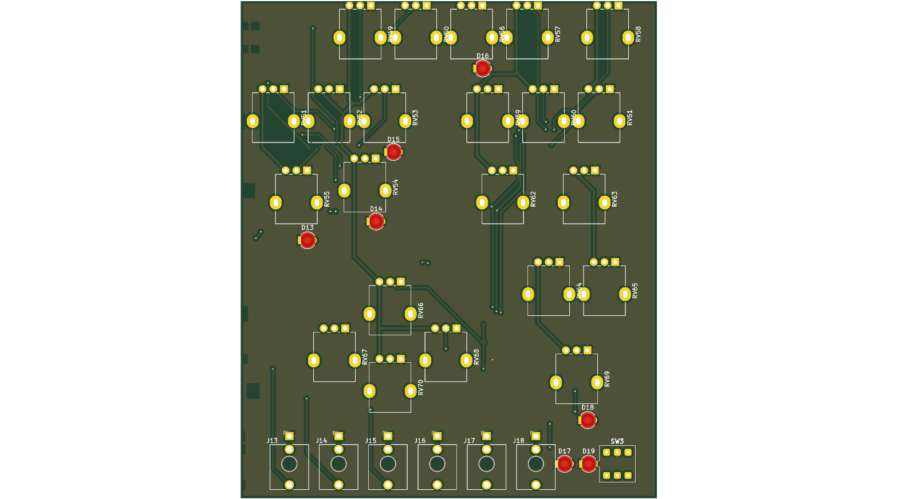
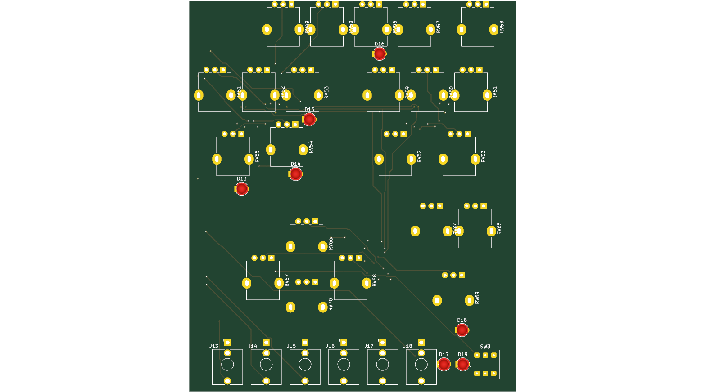
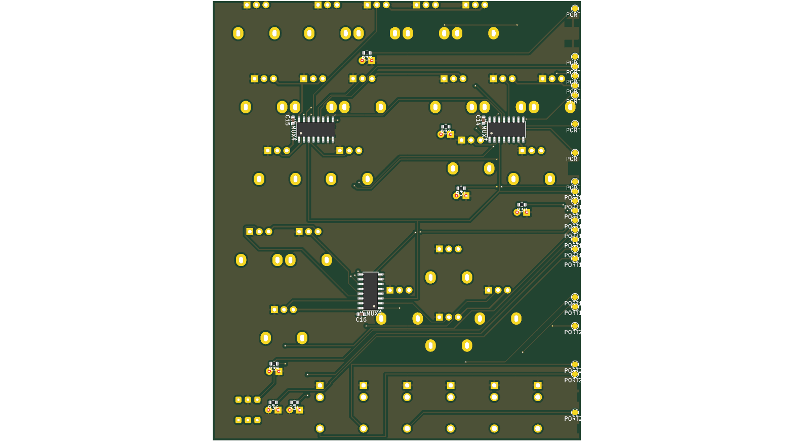
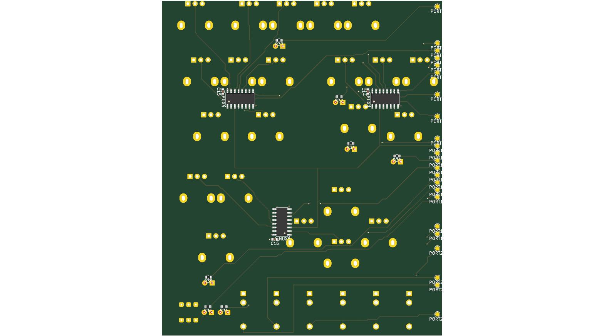

# Rev A routing spike (P4a)

Spec: [`../superpowers/specs/2026-09-29-rev-a-p4a-routing-spike-design.md`](../superpowers/specs/2026-09-29-rev-a-p4a-routing-spike-design.md)

**Status: done 2026-09-29.** Recommendation, for Bastian to decide (master
plan working rule 9): **P4 routes with our own router** (`hardware/gen/route.py`)
**on 4 layers.** Ours was the only method with every gated step green on
2 layers. On 4 layers, GND and SM_3V3 become planes instead of 0.4 mm
tracks. GND is then one island on In1, where 2 layers leave 10 + 21 fill
islands. The signal routing stays about the same: 1733.0 mm against
1742.5 mm, and 36 signal vias against 53. In total the board has 55 vias
instead of 74. The extra cost is $25.60 per order of five boards, $21.00 of
it the engineering fee.

## Question

P4 has two open decisions, and this spike feeds both (spec §1, §4.4):

1. **How does P4 route?** Our own grid router, or Freerouting through KiCad's
   Specctra export. Both routers got the same board and the same proof.
2. **2 or 4 layers?** The winner routed the strip once more on 4 layers, and
   the JLC price was looked up for both.

## Setup

- **Strip:** the SENSE_1 mux region, the hardest of the four: outline
  x 203–300, y 6–122 mm. The outline is an assumption, and the west edge is
  a cut (spec §2.1).
- **Parts:** 72 in total ([Strip](#strip-task-2)). 36 panel parts sit on
  their P1 holes: 22 pots (pins north), 6 jacks, 7 LEDs and 1 key. 13 SMD
  parts on the back were placed by a search: 3 muxes, 3 × 100 nF and 7 LED
  resistors. There are 23 ports and 52 nets.
- **Keepouts:** 13 foreign pads that reach over the cut
  ([Strip](#strip-task-2)), plus each PJ398SM jack's own F.Cu rule area
  ([Task 6, fix 1](#our-own-router-2-layers-task-6);
  [Task 7, fairness](#freerouting-2-layers-task-7)).
- **Ports:** 23 SMD pads in one column at x 204.5, on 2.54 mm slots, one for
  each net that leaves the strip ([Locked nets](#locked-nets-task-3)).
- **Locked nets:** SENSE_1, OUT_L and OUT_R are hand-routed as 14 segments
  on B.Cu at 0.25 mm; a proof step fails if any of them changes
  ([Locked nets](#locked-nets-task-3)).
- **Rules:** signal 0.25 mm, supply 0.4 mm, clearance 0.2 mm, via 0.6 mm
  with a 0.3 mm drill. These are spec §3.1's values, the coupon's. The
  widths are set in `stripe.py` (`W_SIGNAL`, `W_SUPPLY`), and the clearance
  and via come from the defaults of `kipcb.set_netclasses()`.
  - On 2 layers, GND and SM_3V3 are routed as tracks, then GND is filled on
    both sides.
  - On 4 layers, GND is a plane on In1 and SM_3V3 a plane on In2.
  - Freerouting was v2.4.1 on Temurin 25.0.4.1
    ([Task 4](#freerouting-task-4)).
- **Router parameters (our own):** grid pitch 0.2 mm, via cost 8, at most
  30 iterations, as in `own.py`. Spec §3.2 said 0.25 mm; the plan set 0.2 mm
  for finer channels, and the spike ran at 0.2 mm.

## Results

| | own, 2 layers | Freerouting, 2 layers | own, 4 layers |
|---|---|---|---|
| Gated reds, final run | **none** | **1**: `ratsnest`, LED14 `PORT2.1`–`R32.1` | **none** |
| Unrouted before fill | 0 | 1 | 0 (counted after the plane fill, 75 before it) |
| Vias | 74 | 45 | 55 (36 routed + 19 stitching) |
| Track length ¹ | 2682.9 mm | 2816.3 mm | 1733.0 mm |
| … of which signal / supply (own router only) ⁶ | 1742.5 / 940.4 mm, vias 53 / 21 | — | 1733.0 / 19.0 mm (stitching stubs), vias 36 / 19 |
| Routing seconds | 13.8 (re-runs 14.2–15.0) | 15.0 ² | 6.2 |
| Runs to green | 1 (+ adapter fix 1b ³) | none in 7 (budget used up) | 2 |
| Agent time to the first green run ⁴ | ≈ 12 min (16:13 → ≈ 16:25) | none; budget used 17:27 → ≈ 17:45 | ≤ ≈ 23 min (17:47 → green on run 2, task done ≈ 18:10) |
| Reproducible (`cmp`) | yes: board | yes: SES, DSN, board, PNGs (run 2 = run 7) | yes: board, PNGs |
| Audio: nearest LED track to OUT_L/OUT_R ⁵ | 2.71 mm (LED16) | 0.50 mm (LED18) | 2.21 mm (LED16) |
| Ungated DRC counts that differ between the runs ⁷ | `starved_thermal 8` | `starved_thermal 4`, `track_width 15` (0.1874 mm), `unconnected_items 1` (the LED14 connection of the `ratsnest` red) | none of the three |
| GND copper | fill: F.Cu 8430 mm² in 10 islands, B.Cu 7515 mm² in 21 | fill: F.Cu 8698 mm² in 4 islands, B.Cu 6537 mm² in 16 | plane: In1 9722 mm² in 1 island ⁸ |
| Source | [Task 6](#our-own-router-2-layers-task-6) | [Task 7](#freerouting-2-layers-task-7) | [Task 8](#own-4-layers-task-8) |

¹ No figure includes the three locked nets. For our router it is the
router's own sum over the nets it routes: 49 on 2 layers, and 47 on 4 layers,
where the planes carry GND and SM_3V3. For Freerouting it was read off the
board, counting every net except the locked three.
² The Java subprocess's wall time, including start-up.
³ Run 1 was green on every step gated at that time. It also carried
`items_not_allowed 1`, which was not gated yet: a track through a jack's own
rule area. The adapter fix (1b) feeds footprint rule areas to the router, and
`items_not_allowed` is gated from 1b on.
⁴ Approximate, read off the controller's clock (spec §4.2).
⁵ The coupon's rule is 10.0 mm. Neither router knows it, so it is measured
but not gated (spec §4.1, step 5).
⁶ Read off the saved boards by net group
([Plane and length probes](#plane-and-length-probes-task-9)). On 2 layers
the router routes 49 nets, the supply included, as 596 segments at 0.4 mm.
On 4 layers it routes 47 nets, and the planes carry GND and SM_3V3. The
drop in total length, 2682.9 → 1733.0 mm, is therefore almost all supply
track (940.4 mm) moving into the planes. The signal length barely changes.
⁷ Every other ungated class is the same in all three runs
(`copper_edge_clearance 15`, `courtyards_overlap 6`, `pth_inside_courtyard 2`,
`silk_edge_clearance 23`, `silk_over_copper 44`, `silk_overlap 20`). The
copper step prints `unconnected_items` only when it is not 0.
⁸ One island is what was measured: the fill's outline count. How much the
clearances around holes and vias perforate the plane was not measured
([Plane and length probes](#plane-and-length-probes-task-9)).

Every proof took about 3 s.

## Pictures

| | own, 2 layers | Freerouting, 2 layers | own, 4 layers |
|---|---|---|---|
| top |  |  |  |
| bottom (mirrored, ports on the right) |  |  |  |

- `own-2L-top.png`: a vertical bundle of four to six tracks runs down the
  middle between the upper pot rows, and long 45° runs cross the lower-left
  quarter towards the jacks.
- `own-2L-bottom.png`: the three muxes fan out into the port column, and a
  diagonal bundle runs from U_MUX5 to the lower ports. Apart from the port
  approaches, only the locked OUT_R run follows the outline.
- `freerouting-2L-top.png`: narrow bundles run through the pot columns. The
  dark bays are GND fill that was removed, the largest between RV51, RV52
  and RV55.
- `freerouting-2L-bottom.png`: long straight runs lead from the muxes to the
  ports. Large unfilled areas along the port side and in the lower right
  account for the 978 mm² of B.Cu GND that Freerouting has less than our
  router.
- `own-4L-top.png`: the outer layers have no fill. The top side is mostly
  empty, with one horizontal bundle between the RV51–RV61 row and D15.
- `own-4L-bottom.png`: the muxes fan out to the ports. The locked SENSE_1
  trunk shows as the rectangle down to y 64, and the stitching vias are the
  dots beside the SMD parts.

## Prices

From [JLC prices](#jlc-prices-task-9), quoted on 2026-09-29 for 5 boards
of FR-4, 1.6 mm, at the **assumed** 295 × 116 mm:

| | 2 layers | 4 layers | difference |
|---|---|---|---|
| Engineering fee | $4.00 | $25.00 | $21.00 |
| Board | $16.50 | $21.10 | $4.60 |
| Calculated price, 5 boards | $20.50 | $46.10 | **$25.60** |
| Build time | 2 days | 3–4 days | |

Most of the difference, $21.00 of $25.60, is the engineering fee. Whether
a reorder of the same design pays that fee again is **unverified**: only a
first order was quoted. Shipping ($29.94) is the same for both. P4 sets the
real outline, and the price follows from it.

## Findings for P4

1. **The audio rule has to be given to the router.** The nearest LED track
   is 2.71, 0.50 and 2.21 mm from the audio nets, against the coupon's
   10.0 mm ([Results](#results)). Freerouting honoured a Specctra
   `class_class` clearance as an edge-to-edge distance that covers pads too.
   With a 3 mm rule, two nets ran 3.658 mm apart track to track (0.435 mm
   without the rule) and 3.033 mm from track to pad. That was shown only on
   a 40 × 20 mm probe board with two nets, never on the real strip
   ([Task 4, class_class](#freerouting-task-4)). `route.py` has one board
   clearance, and its clearance classes differ only by track half-width. P4
   needs a per-net-pair clearance in it: audio nets against LED nets, to be
   rasterised like the existing halo. Four layers do not solve this (2.21 mm).
2. **Pot orientation and the rail zone.** With pins north, the top pot row's
   15 pins (RV49, RV50, RV56, RV57, RV58) sit at y 7.0, 1 mm from the
   assumed edge at y 6. KiCad counts them as `copper_edge_clearance 15`, and
   Freerouting as 30 hole-clearance violations, each pin twice
   ([Placement probes](#placement-probes-task-9);
   [Task 7, "30 violations"](#freerouting-2-layers-task-7)). P4 has to choose
   between the rail zone and this orientation. Pins south shorted five LEDs
   onto pot pins (spec §2.2).
3. **LED pads sit inside pot and jack courtyards.** Even the unrouted strip
   has 6 `courtyards_overlap`: D16/RV56, D14/RV54, D17/J18, D15/RV53, D19/SW3
   and D15/RV54. It also has 2 `pth_inside_courtyard`: D17's pad 1 inside
   J18, and D15's pad 1 inside RV54
   ([Placement probes](#placement-probes-task-9)). The positions come from
   P1's hole list. Parts on the front can collide physically, and no gated
   check looks at this.
4. **Port order.** The port column orders nets by the mean y of their source
   pads, and breaks ties by net name. All six jack nets tie at y 118.92, so
   the column reads GATE_B, MOD1_B, MOD2_B, OUT_L, OUT_R, PITCH_B
   ([Placement probes](#placement-probes-task-9)). That puts OUT_L above
   OUT_R, although OUT_L's jack J17 is west of J18. OUT_R therefore leaves
   its tip southward and passes under J17 along y 121.0, 0.875 mm from the
   outline ([Locked nets](#locked-nets-task-3)). Any boundary P4 routes to,
   such as the module header, should be ordered by the geometry of its
   sources, with ties broken by x.
5. **OUT_L and OUT_R run side by side for 50.0 mm**, from x 204.5 to 254.5,
   2.54 mm apart centre to centre on B.Cu
   ([Placement probes](#placement-probes-task-9)). L/R crosstalk was not
   checked. P4 should set their spacing, or put a guard between them, on
   purpose.
6. **The SMD placement search** is a first fit on a square spiral. It found
   a place for all 13 back-side parts, and the gated checks stayed at 0. The
   muxes ended 8.2, 8.5 and 3.6 mm from the centroids of their pot groups,
   and each 100 nF ended 1.778 mm from its VCC pad (limit 2.0). Every LED
   resistor sits 2.00 mm north of its LED
   ([Placement probes](#placement-probes-task-9)). The search does not
   consider routing. A mux's rotation (90, 90, 0) comes from the order of
   the ring, not from the direction of its pins. R32 lands in the pocket
   between D15, RV53 and RV54 (item 3), and LED14 → R32.1 is the one
   connection Freerouting left unrouted. Keep the search as a seed for P4,
   not as its placement.
7. **The port column does not carry over to the full board.** The column
   exists only because of the cut. It packs 23 ports into keepout-free
   2.54 mm slots, and the order-preserving assignment pushes some ports far
   from their sources: LED14's port sits at y 20.70, 18.5 mm north of R32.1
   ([Placement probes](#placement-probes-task-9)). Two things carry over:
   the ordering lesson (item 4), and treating a region boundary as pads.
8. **The stitch search needs `netless_blocks`.** The coupon's via search
   skips netless pads. The Rev A pots' mounting tabs are netless PTH pads,
   and on 4 layers two GND stitching vias landed on RV52's and RV60's tabs
   (`shorting_items 10`, `hole_clearance 8`). Rev A passes
   `netless_blocks=True`, and the coupon keeps the default
   ([Task 8, run 1](#own-4-layers-task-8)).
9. **Freerouting narrows tracks.** It left 15 tracks at 0.1874 mm against
   the 0.25 mm class, at U_MUX5's SOIC pins (`track_width 15`, a DRC error).
   The class stays ungated for this spike (Ruling R9): gating it after both
   methods had run would have changed the judge. The cause is inferred
   to be `router.automatic_neckdown` and was not probed
   ([Task 7](#freerouting-2-layers-task-7)).
10. **`PCB_VIA::GetWidth()` without a layer hangs pcbnew.** It opens a modal
    wxWidgets debug alert, and the process sat idle for more than
    10 minutes. Every P4 script that reads vias must call
    `GetWidth(pcbnew.F_Cu)` ([Task 8](#own-4-layers-task-8)).
11. **KiCad's DSN export rounds wire coordinates.** Locked wire ends missed
    their pad centres by up to 0.5 µm. The export's six significant digits
    are inferred, not read in KiCad's source. Freerouting added two 0.5 µm
    stubs on SENSE_1, which turned the `locked` step red. `fix_locked_wires()`
    snaps the ends onto the pads and splits a T-junction
    ([Task 7, run 1](#freerouting-2-layers-task-7)). This matters only if
    Freerouting comes back.
12. **What the renders show that no check caught**
    ([Pictures, Task 9](#pictures-task-9)):
    - In all three top renders, F.Cu tracks cross inside the drawn pot
      outlines, under the pot bodies. The spec lets front-side bodies block
      nothing (§2.2), so whether an Alpha 9 mm body over mask-covered track
      is acceptable is P4's call.
    - On 2 layers the GND fill leaves dark unfilled bays in both runs, on
      both sides. No gated check measures fill coverage.
    - In the bottom renders each port label lies across the next port's pad
      and is cut off at the board edge, and C15's label runs into U_MUX4's
      reference. This is silk, and ungated.
13. **Gaps in the harness P4 should close:**
    - `unconnected_by_net()` printed nothing for our router's `ratsnest`
      RED ([Task 6](#our-own-router-2-layers-task-6)).
    - On 4 layers, "unrouted before fill" is counted after the plane fill,
      and whether that count can go red on its own was not probed
      ([Task 8](#own-4-layers-task-8)).
    - Spec §4.1's `*_missing` mode is absent for the `copper` and `ratsnest`
      checks, and the `before is None` guard is untested. P4's proof should
      close these.

## Recommendation

*A recommendation, not a decision. Bastian decides (master plan working
rule 9).*

**Decided 2026-09-29 by Bastian:** accepted as recommended. P4 routes with
our own router on 4 layers.

**Routing method: our own router.** Ruling R8 already chose it as the
spike's winner by its first criterion: every gated step green. Ours was
green on its first run (plus the adapter fix, Results footnote ³).
Freerouting ended with LED14 unrouted after its 7-run budget. That makes it
"not green within the budget", not "cannot":

- `-us` and `-is` left no trace in its log beyond the command line.
- Its scoring and neck-down settings were never tried.
- Runs 3–6 were byte-identical to run 2
  ([Task 7](#freerouting-2-layers-task-7)).

Run accounting was not symmetric: our router's rule-area fix (1b) was not
counted as a budget run, while Freerouting's DSN fix used run 2. Because runs
3–6 were byte-identical to run 2, the outcome does not depend on it.

Our router is deterministic, runs without Java and makes no network call.
Freerouting checks api.github.com on every run
([Task 4](#freerouting-task-4)). Ours also keeps the full track width. The
price is untidier geometry: 74 vias against 45, and 1322 track segments
against 525. We also have to build a per-net-pair clearance (finding 1).
Freerouting's `class_class` was shown only on a two-net probe board, never
on the strip, so Freerouting's version of that rule is not proven either.

**Layers: 4.** Our router routed 2 layers cleanly, so by the spec's own
premise (§1) routability is no longer an argument. What 4 layers buy is the
planes, not shorter signal routing
([Plane and length probes](#plane-and-length-probes-task-9)):

- **GND:** one 9722 mm² island on In1, against a 2-layer fill cut into
  10 + 21 islands with 8 starved thermals. Plane perforation was not
  measured. The board carries pot readings through analog muxes, and the
  audio outputs.
- **Supply:** GND and SM_3V3 need no routing: 596 segments and 940.4 mm of
  0.4 mm track on 2 layers become 19 stitching stubs.
- **Signals:** about the same. 1733.0 mm against 1742.5 mm, and 36 signal
  vias against 53. In total there are 55 vias against 74.
- **The rest of the board:** this strip is one of four regions. The shift
  registers, the module and the SD socket are not on it, so how much
  2-layer room the full board has is unmeasured.

The cost is $25.60 per order of five boards, quoted for the assumed
outline: $21.00 of it the engineering fee, $4.60 the board. Whether a
reorder pays the fee again is unverified. Build time is one to two days
longer. 4 layers do not fix the audio distance (2.21 mm against 2.71); that
is finding 1's job on either layer count.

## What stays

- `hardware/gen/kipcb.py`, `hardware/gen/pcb_proof.py` and
  `hardware/gen/stitch.py` stay. The coupon rebuilds byte-identically on
  them.
- `hardware/gen/route.py` stays, because our router won. If Bastian picks
  Freerouting instead, `route.py` is removed in a follow-up commit on this
  branch and kept on the tag `attic/route-spike-2026-10`.
- `hardware/reva/spike/`, which includes `freerouting.py`, is removed when
  P4 starts. The Freerouting jar and the JRE live outside the repository,
  in `%LOCALAPPDATA%\fireflow-tools\`.

## Measurement log

Every number below was printed by the command beside it.

### Strip (Task 2)

Clean run (`KIPY` is KiCad 10.0's Python):

    KIPY hardware/reva/spike/run.py --method none --layers 2

    built the strip: 72 parts, 13 keepouts, 23 ports in 7.9 s
       keepout J12.S      x 203.00..203.96 y 106.41..108.64
       keepout J12.T      x 203.00..204.06 y 117.66..120.19
       keepout J12.TN     x 203.00..204.06 y 109.36..111.89
       keepout RV38.tab   x 203.00..203.91 y 32.18..35.82
       keepout RV40.tab   x 203.17..206.28 y 48.40..52.04
       keepout RV40.1     x 203.00..203.52 y 41.62..43.82
       keepout RV44.tab   x 203.00..204.66 y 77.18..80.82
       keepout RV48.tab   x 204.29..207.41 y 95.18..98.82
       keepout RV48.1     x 203.00..204.65 y 88.40..90.60
       keepout SW2.2      x 203.00..204.80 y 10.80..12.80
       keepout SW2.3      x 205.30..207.30 y 10.80..12.80
       keepout SW2.5      x 203.00..204.80 y 16.20..18.20
       keepout SW2.6      x 205.30..207.30 y 16.20..18.20
    wrote hardware\reva\spike\out\none-2L.kicad_pcb
        1. nets       52 nets, 0 differ from the intent node for node
        2. anchors    36 panel parts, worst 0.0000 mm off its hole (limit 0.01)
        3. decoupling 3 decouplers, worst 1.778 mm (limit 2.0)
        4. copper     gated: shorting_items 0, clearance 0, hole_clearance 0, hole_to_hole 0, tracks_crossing 0, track_dangling 0 (not gated: copper_edge_clearance 15, courtyards_overlap 6, pth_inside_courtyard 2, silk_edge_clearance 23, silk_over_copper 44, silk_overlap 20, unconnected_items 133)
        5. render     rendered none-2L-top.png, none-2L-bottom.png
    proof took 2.4 s -- GREEN

The 15 `copper_edge_clearance` are the top pot row's pins (pins north) at
y about 7.0 against the assumed edge at y 6: a finding for P4's rail zone.

Placement-stage sabotages, each `KIPY hardware/reva/spike/run.py --method none --layers 2 --sabotage <name>`,
each exit 1 (the `nets` line is followed by a per-net want/got dump, shortened here):

    --sabotage nets
    RED 1. nets       52 nets, 2 differ from the intent node for node
            SABOTAGE want [] got [('D13', '1')]
    --sabotage nets_missing
    RED 1. nets       examined 0 nets
    --sabotage anchors
    RED 2. anchors    36 panel parts, worst 0.5000 mm off its hole (limit 0.01)
            D13 sits 0.500 mm off its hole
    --sabotage anchors_missing
    RED 2. anchors    examined 0 panel parts
    --sabotage decoupling
    RED 3. decoupling 3 decouplers, worst 4.665 mm (limit 2.0)
            C14 is 4.665 mm from U_MUX3's VCC pad
    --sabotage decoupling_missing
    RED 3. decoupling examined 0 decouplers
    --sabotage copper
    RED 4. copper     gated: shorting_items 0, clearance 1, hole_clearance 0, hole_to_hole 0, tracks_crossing 0, track_dangling 1 (not gated: copper_edge_clearance 15, courtyards_overlap 6, pth_inside_courtyard 2, silk_edge_clearance 23, silk_over_copper 44, silk_overlap 20, unconnected_items 134)
            clearance: 1
            track_dangling: 1

### Locked nets (Task 3)

The three rule-bearing nets are hand-routed as data in
`hardware/reva/spike/locked.py` (all B.Cu, no vias, 0.25 mm), locked, and
checked by the new `locked` step, which runs before `copper`. Corners were
drawn against:

    KIPY hardware/reva/spike/run.py --method none --where SENSE_1
       PORT10   1   (204.500, 56.260) B.Cu
       U_MUX5   3   (255.968, 84.551) B.Cu
       U_MUX4   3   (274.767, 42.413) B.Cu
       U_MUX3   3   (224.491, 42.435) B.Cu
       port: PORT10
    KIPY hardware/reva/spike/run.py --method none --where OUT_L
       PORT21   1   (204.500, 101.980) B.Cu
       J17      T   (260.300, 118.920) F.Cu/B.Cu
       port: PORT21
    KIPY hardware/reva/spike/run.py --method none --where OUT_R
       PORT22   1   (204.500, 104.520) B.Cu
       J18      T   (271.800, 118.920) F.Cu/B.Cu
       port: PORT22

Clean run:

    KIPY hardware/reva/spike/run.py --method none --layers 2

    built the strip: 72 parts, 13 keepouts, 23 ports in 8.2 s
    locked 14 items on SENSE_1, OUT_L, OUT_R
    (13 keepout lines as above)
    wrote hardware\reva\spike\out\none-2L.kicad_pcb
        1. nets       52 nets, 0 differ from the intent node for node
        2. anchors    36 panel parts, worst 0.0000 mm off its hole (limit 0.01)
        3. decoupling 3 decouplers, worst 1.778 mm (limit 2.0)
        4. locked     14 locked segments unchanged on SENSE_1, OUT_L, OUT_R
        5. copper     gated: shorting_items 0, clearance 0, hole_clearance 0, hole_to_hole 0, tracks_crossing 0, track_dangling 0 (not gated: copper_edge_clearance 15, courtyards_overlap 6, pth_inside_courtyard 2, silk_edge_clearance 23, silk_over_copper 44, silk_overlap 20, unconnected_items 128)
        6. render     rendered none-2L-top.png, none-2L-bottom.png
    proof took 2.6 s -- GREEN

Segments per net, read back from the saved and reloaded board (every one
still on its own net and locked, so no corner touches a foreign pad):
SENSE_1 7, OUT_L 3, OUT_R 4. `unconnected_items` drops from 133 to 128 --
the 3 SENSE_1 connections plus one each for OUT_L and OUT_R; the report
names none of the three nets as unconnected.

One topology fact the routes had to respect: the port column puts OUT_L
(y 101.98) above OUT_R (y 104.52), while the jacks put OUT_L's tip (J17)
west of OUT_R's (J18). Two tracks with that terminal order cannot both
leave their tips northward without crossing, so OUT_R leaves J18 southward
and passes under J17's tip along y 121.0 (0.875 mm from the outline; the
board's edge rule is 0.5 and `copper_edge_clearance` stays at 15).

Locked-step sabotages, each exit 1:

    KIPY hardware/reva/spike/run.py --method none --layers 2 --sabotage locked
    RED 4. locked     14 locked segments unchanged on SENSE_1, OUT_L, OUT_R
            moved or added: ('SENSE_1', 'B.Cu', 246.0, 84.551, 256.468, 84.551, 0.25)
            gone: ('SENSE_1', 'B.Cu', 246.0, 84.551, 255.968, 84.551, 0.25)
    KIPY hardware/reva/spike/run.py --method none --layers 2 --sabotage locked_missing
    RED 4. locked     examined 0 locked segments

The `locked` sabotage moves a segment end 0.5 mm inside U_MUX5's COM pad,
so only `locked` turns red (`copper` stays green). With the new step
`copper` is step 5; re-run of the Task 2 sabotage:

    KIPY hardware/reva/spike/run.py --method none --layers 2 --sabotage copper
    RED 5. copper     gated: shorting_items 0, clearance 1, hole_clearance 0, hole_to_hole 0, tracks_crossing 0, track_dangling 1 (not gated: copper_edge_clearance 15, courtyards_overlap 6, pth_inside_courtyard 2, silk_edge_clearance 23, silk_over_copper 44, silk_overlap 20, unconnected_items 129)

`ratsnest` and `audio_missing` are proven on the first routed board
(Task 6).

### Freerouting (Task 4)

**Install.** Bastian approved both downloads. Both live outside the repo in
`%LOCALAPPDATA%\fireflow-tools\`: `freerouting.jar` = freerouting-2.4.1.jar
(64,076,787 bytes, github.com/freerouting/freerouting release v2.4.1,
published 2026-09-03) and `jre/` = Eclipse Temurin
OpenJDK25U-jre_x64_windows_hotspot_25.0.4.1_1.zip (58,475,080 bytes).
Freerouting 2.4 requires Java 25.

    "$LOCALAPPDATA/fireflow-tools/jre/bin/java.exe" -version
    openjdk version "25.0.4.1" 2026-08-18 LTS
    OpenJDK Runtime Environment Temurin-25.0.4.1+1 (build 25.0.4.1+1-LTS)
    OpenJDK 64-Bit Server VM Temurin-25.0.4.1+1 (build 25.0.4.1+1-LTS, mixed mode, sharing)

    "$LOCALAPPDATA/fireflow-tools/jre/bin/java.exe" -jar "$LOCALAPPDATA/fireflow-tools/freerouting.jar" -l en -help
    USAGE
      freerouting [PARAMETERS]
    PARAMETERS
      -de <design.dsn>          Load the Specctra .dsn file
      -di <design_directory>    Set the default folder used by open-design dialogs
      -dr <design_rules_file>   Read routing rules from a .rules file
      -do <output_file>         Save the board (.dsn), session (.ses), or
                                Autodesk Fusion script (.scr) at the end
      -mp <number_of_passes>    Set the maximum number of auto-routing passes to perform
      -l  <language>            "en" for English, "de" for German, or "zh" for Simplified
                                Chinese; otherwise, use the system default. English is
                                used by default for unsupported languages.
      -mt <number_of_threads>   Set the thread-pool size for route optimization. The
                                default is one fewer than the number of logical
                                processors in the system.
      -us <updating_strategy>   Greedy, Global, or Hybrid. Set the board update strategy
                                for route optimization. The default is greedy. When
                                Hybrid is selected, use the "hr" option to specify the
                                hybrid ratio.
      -hr <m:n>                 Set the hybrid ratio in the format of
                                #_global_optimal_passes:#_prioritized_passes. The
                                default is 1:1. This option is effective only when the
                                Hybrid strategy is selected.
      -is <selection_strategy>  Sequential, random, or prioritized. Set the item-selection
                                strategy for route optimization. The default is
                                prioritized, which selects items based on scores
                                calculated during the previous round.
      -h                        Display this help

(Two-column layout condensed here; the wording is Freerouting's.) `-help`
does not list `-da`, `-inc` or `--gui.enabled=false`. The jar's argument
parser (`app/freerouting/settings/GlobalSettings.class`, string constants
read with a zipfile script) accepts `-de -di -do -drc -dr -mp -mt -oit -us
-is -hr -l -dl -da -host -inc -dct -ll`, `--help`, `--compare-boards=`,
and a generic `--<section>.<key>=<value>` form (plus `FREEROUTING__*`
environment variables) over the `freerouting.json` settings tree. The
probe runs below are the authority for what each spelling does.

**Where to look.** Freerouting appends every run to one log file,
`%LOCALAPPDATA%\freerouting\logs\freerouting.log`, at DEBUG level. The
console shows INFO and above only, so the analytics line below never
appears on the console. One run's section is the text from the last
`INFO   Freerouting v` banner to the end of the file; the probes cut it out
that way right after each run (`log[log.rfind("INFO   Freerouting v"):]`).

**What the switches do (probed).** 29 routing runs in all. The first,
aborted, run of `probe_fr.py` is one of them: its guard looked for the
analytics line on the console, found nothing, and stopped after `fr1`; the
guard was moved to the log section and the probe re-run. Counts over the
shared log after the last run (16:08:42):

    grep -c "INFO   Freerouting v"   "$LOCALAPPDATA/freerouting/logs/freerouting.log"   -> 30
    grep -c "Analytics are disabled" "$LOCALAPPDATA/freerouting/logs/freerouting.log"   -> 29
    grep -c "Screen:"                "$LOCALAPPDATA/freerouting/logs/freerouting.log"   -> 1
    grep -c "No new version"         "$LOCALAPPDATA/freerouting/logs/freerouting.log"   -> 29

30 banners = the first `-help` call (15:59:24) + 29 runs. (The second
`-help` call, with `-l en`, logged elsewhere, see below.)

- `-da`: every run logs `DEBUG  Analytics are disabled` right after the
  startup banner, before the board loads (29 of 29, count above). `-da` is
  per run only: `%APPDATA%\freerouting\freerouting.json` (created by the
  first `-help` call) still read `"allow_telemetry": true` and
  `"disable_analytics": false` after all 29 runs and was not rewritten by
  them. Afterwards, at Bastian's decision, the controller changed that file
  to `allow_telemetry=false`, `allow_contact=false`,
  `disable_analytics=true`; runs still pass `-da`.
- `--gui.enabled=false`: headless -- rc 0, no window, and the only
  `Screen:` line in the log is the `-help` call's (`Screen: 3440x1440, 96
  DPI`). Run time, banner to "Successfully saved output file", from
  `grep -n "INFO   Freerouting v\|Successfully saved output file" <log>`:
  `fr1` 16:03:00.473 -> 16:03:02.632 (2.16 s); over all 29 pairs of that
  grep the shortest is `v_k12_noLwires` (16:06:04.392 -> 16:06:06.050,
  1.66 s) and the longest `v_k12_LFonly` (16:07:30.791 -> 16:07:32.956,
  2.17 s). The routing stage itself takes about 0.5 s of that
  (`Auto-routing stage completed ... completed in 0.50 seconds`).
- `-mp 20` / `-mt 1`, from `grep -h "Applied CLI router setting" $S/fr1.log`:

      2026-09-29 16:03:01.593 DEBUG  Applied CLI router setting: router.max_passes = 20
      2026-09-29 16:03:01.593 DEBUG  Applied CLI router setting: router.max_threads = 1
      2026-09-29 16:03:01.593 DEBUG  Applied CLI router setting: router.enabled = true (implicit from -de/-do batch mode)

  Whether 20 passes are enough on the real strip is unknown; on the probe
  boards the router stopped before 20 on its own
  (`grep -h "Stopping the auto-router" $S/fr1.log $S/nk1.log`):

      INFO   [629BBE\AC39E8] The router's best score (666.64) has not improved by more than 0.5 points since pass #8. Stopping the auto-router after 18 passes (1 item still unconnect...
      INFO   [6FAB30\8E695D] The router's score (999.97) has not improved by more than 0.5 points in the last 10 passes (0 items still unconnected). Stopping the auto-router.
- `-inc Other`: accepted, no error, **no effect**. On `nk.dsn` (below) the
  SES with `-inc Other` is byte-identical to the one without it, and net B
  (class `Other`) is routed in both. `--router.ignore_net_classes=Other`
  is logged as `Applied CLI router setting: router.ignore_net_classes =
  Other` and is equally byte-identical (raw output under "DSN variants").
  *Inferred, not probed:* the string `ignoreNetClasses` occurs, outside the
  settings classes, only in `gui/board/GuiManager.class`, which suggests it
  is applied only in the GUI path.
- `-l en`: switches the help and GUI language, but **also moved the log
  file** to `<cwd>\en\freerouting.log` (startup log: `log file :
  C:\Users\bernd\Documents\AI\FireFlow\en\freerouting.log`). The stray
  folder was deleted; `-l` is not part of `FR_ARGS`.
- Not switchable, found in the run logs: every routing run makes a version
  check (`DEBUG  No new version available. Current version is up to date:
  v2.4.1`); the jar's `util/VersionChecker` requests
  `https://api.github.com/repos/freerouting/freerouting/releases/latest`
  with the User-Agent `Freerouting-Version-Checker` (string constants of
  that class). No setting for it was found in the jar's settings classes.
  It is not the analytics client. Bastian accepted this version check on
  2026-09-29.
- The two `-help` calls (one by the controller, one here) ran without
  `-da`; their logs contain neither `Analytics are disabled` nor a version
  check line, so whether they sent anything cannot be told from the log.

**Probe board.** `probe_fr.py` (scratchpad; the brief's skeleton plus
logging), under `KIPY`: 40 x 20 mm, 2 layers, SMD test-point pads. Nets A
(5,10)-(35,10) and B (20,3)-(20,17) must cross; net L (5,15)-(35,15) is
drawn on F.Cu and B.Cu and locked; a keepout covers x 26..30, y 0..12 on
both layers; classes `Sig` = {A}, `Other` = {B}.

`$S` is the session scratchpad folder `...\scratchpad\task4`; the probe
echoes a filtered part of each run's log section (the `|` lines; the first
24 characters, the timestamp, are cut off). Full output of the second,
complete run:

    "/c/Users/bernd/AppData/Local/Programs/KiCad/10.0/bin/python.exe" "$S/probe_fr.py"
    export True
    resolution line: ['(resolution um 10)']
    fix wires in DSN: 2 keepouts: 2
    class lines: ['(class kicad_default L', '(class Sig A', '(class Other B']
    RUN java.exe -jar freerouting.jar -de fr.dsn -do fr1.ses --gui.enabled=false -da -mp 20 -mt 1
    freerouting rc 0 ses written True
       | DEBUG  Command line arguments: '-de fr.dsn -do fr1.ses --gui.enabled=false -da -mp 20 -mt 1'
       | DEBUG  GUI Language: de_DE
       | DEBUG  Analytics are disabled
       | DEBUG  Set DEFAULT clearance (all layers): 2000 (0.05 mm) from DSN value 200.0
       | DEBUG  Set clearance (all layers): smd_smd = 500 (0.0125 mm), classes [2,2]
       | DEBUG  Set DEFAULT clearance (all layers): 2000 (0.05 mm) from DSN value 200.0
       | DEBUG  Set clearance (all layers): smd_smd = 500 (0.0125 mm), classes [2,2]
       | DEBUG  No new version available. Current version is up to date: v2.4.1
       | DEBUG  Set DEFAULT clearance (all layers): 2000 (0.05 mm) from DSN value 200.0
       | DEBUG  Set clearance (all layers): smd_smd = 500 (0.0125 mm), classes [2,2]
       | DEBUG  Applied copper-to-edge clearance override: 500.0 um (5000 board units).
       | DEBUG  Set DEFAULT clearance (all layers): 2000 (0.05 mm) from DSN value 200.0
       | DEBUG  Set clearance (all layers): smd_smd = 500 (0.0125 mm), classes [2,2]
       | INFO   [629BBE\AC39E8] Fanout stage completed: started with 6 total SMD pins, completed in 0.09 seconds, escaped pins: 6/6 (100.0%), using 0.08 total CPU seconds, 0.09 GB total allocated, and 123.4 MB peak
       | s could not be routed -- please review your design (e.g. check pad clearances, trace width rules, and available routing space):
       | INFO   [629BBE\AC39E8] Auto-routing stage completed: started with 2 unrouted nets, completed in 0.50 seconds, final score: 666.65 (1 unrouted and 0 violations), using 0.00 total CPU seconds, 0.00 GB total a
       | INFO   [629BBE\AC39E8] Optimization stage completed: started with score 666.65 (1 unrouted and 0 violations), completed in 0.01 seconds, final score: 666.65 (1 unrouted and 0 violations), using 0.00 total C
    RUN java.exe -jar freerouting.jar -de fr.dsn -do fr2.ses --gui.enabled=false -da -mp 20 -mt 1
    freerouting rc 0 ses written True
       | (the same lines; job id F02A4B\07FA12, auto-routing 0.49 s, final score 666.65 (1 unrouted and 0 violations))
    two runs byte-identical: True
    import True
    locked geometry unchanged: True
    still locked after import: True count 2
      L before: [('L', 'B.Cu', 5000000, 15000000, 35000000, 15000000, True), ('L', 'F.Cu', 5000000, 15000000, 35000000, 15000000, True)]
      L after : [('L', 'B.Cu', 5000000, 15000000, 35000000, 15000000, True), ('L', 'F.Cu', 5000000, 15000000, 35000000, 15000000, True)]
    tracks starting inside the keepout: 0
    unconnected after import: 2
    RUN java.exe -jar freerouting.jar -de fr-cc.dsn -do fr-cc.ses --gui.enabled=false -da -mp 20 -mt 1
    freerouting rc 0 ses written True
       | (the same lines; job id 7E75F0\E8C097, auto-routing 0.55 s, final score 666.65 (1 unrouted and 0 violations))
    class_class SES written: True
    RUN java.exe -jar freerouting.jar -de fr.dsn -do fr-inc.ses --gui.enabled=false -da -mp 20 -mt 1 -inc Other
    freerouting rc 0 ses written True
       | (the same lines; job id 36B433\7432E5, auto-routing 0.50 s, final score 666.65 (1 unrouted and 0 violations))
    -inc Other: SES mentions net B wires: 1 net A: 0
    exit=0

The unrouted connection, `grep -A2 "could not be routed" $S/fr1.console.txt`:

    The following connections could not be routed -- please review your design (e.g. check pad ...
      Net 'A' (1 unrouted connection):
        - TP_A0-1  ->  TP_A1-1

- Units: `grep -n "(resolution\|(unit" $S/fr.dsn` prints `8:  (resolution
  um 10)` and `9:  (unit um)`. Values in the DSN are in um (`(width 250)` is
  KiCad's 0.25 mm), so the brief's `(clearance 3000)` means 3 mm.
  `resolution um 10` is the internal grid, 10 steps per um; the SES writes
  its coordinates in those steps (width `2500` = 0.25 mm). Freerouting's own
  DEBUG lines label its units wrongly (`DSN=250.0 -> board=2500 (0.0625
  mm)`, `DEFAULT clearance ... 2000 (0.05 mm) from DSN value 200.0`).
- Locked tracks: the SES carries **no** wire of net L at all (`fr1.ses`:
  `network_out` holds only `(net B ...)`). They survive because KiCad's
  import keeps locked tracks; unlocked, the import deletes them:

      "/c/Users/bernd/AppData/Local/Programs/KiCad/10.0/bin/python.exe" "$S/probe_fr6.py"
      L tracks before import: 2 locked: [False, False]
      import True
      L tracks after import: 0
      B tracks after import: 9

  Proven for two straight locked tracks only; locked vias and zones were not
  tested.
- `unconnected after import: 2` is net A's one unrouted connection plus one
  L-to-L pair: L's B.Cu copy touches no pad (the pads are SMD, F.Cu only),
  so it is an island of net L, separate from the F.Cu copy. The DRC
  `unconnected_items` block lists these two items, not two pads of A
  (`probe_fr5.py` saves the imported board and runs `kicad-cli pcb drc`;
  `pcb_proof.unconnected_by_net()` reads pads only, which is why it named A
  alone):

      "/c/Users/bernd/AppData/Local/Programs/KiCad/10.0/bin/python.exe" "$S/probe_fr5.py" "$S/fr1.ses"
      import fr1 True
        live unconnected: 2
        vias: [('B', (5.5621, 16.2196)), ('B', (15.4688, 3.8923))]
        drc: {'track_dangling': 1, 'unconnected_items': 2}
        unconnected by net: {'A': {'TP_A0.1', 'TP_A1.1'}}

      $S/drc-fr1.rpt, lines 5-18:
      ** Found 1 DRC violations **
      [track_dangling]: Track has unconnected end
          Local override; warning
          @(5.0000 mm, 15.0000 mm): Track [L] on B.Cu, length 30.0000 mm

      ** Found 2 unconnected pads **
      [unconnected_items]: Missing connection between items
          Local override; error
          @(5.0000 mm, 10.0000 mm): Pad 1 [A] of TP_A0 on F.Cu
          @(35.0000 mm, 10.0000 mm): Pad 1 [A] of TP_A1 on F.Cu
      [unconnected_items]: Missing connection between items
          Local override; error
          @(5.0000 mm, 15.0000 mm): Track [L] on F.Cu, length 30.0000 mm
          @(5.0000 mm, 15.0000 mm): Track [L] on B.Cu, length 30.0000 mm

  Before any import the same board counts 3 (A, B, and the L island):

      "/c/Users/bernd/AppData/Local/Programs/KiCad/10.0/bin/python.exe" "$S/probe_fr5.py" "$S/none.ses"
        L tracks: [('B.Cu', (5.0, 15.0), (35.0, 15.0), True), ('F.Cu', (5.0, 15.0), (35.0, 15.0), True)]
        pad TP_L1 (35.0, 15.0) L F
        pad TP_L0 (5.0, 15.0) L F
        live unconnected: 3
        vias: []
        drc: {'track_dangling': 1, 'unconnected_items': 3}
        unconnected by net: {'A': {'TP_A1.1', 'TP_A0.1'}, 'L': {'TP_L0.1'}, 'B': {'TP_B0.1', 'TP_B1.1'}}

- Keepout: `tracks starting inside the keepout: 0` is **vacuous** on this
  board -- A is unrouted and B's route runs nowhere near x 26..30. What the
  DSN variants below do show: (1) with the keepout on F.Cu only
  (`k12_FCu`), A runs on F.Cu up to x 25.46, drops to B.Cu under the keepout
  and returns to F.Cu at x 30.53 -- it avoids the keepout's layer and uses
  the free one; (2) with the full two-layer keepout, A routes in six
  variants (`k9`, `k12_noLwires`, `k12_L18.5`, `k12_Lwest`, `k12_Least`,
  `k12_LBonly`: `A 3`) and Freerouting reports `0 violations` for each;
  KiCad's DRC was not run on those six, so there is no `items_not_allowed`
  figure for them. `k12_L17` reports `1 unrouted and 1 violation`, of a
  kind the log does not name (`grep -i -n violation` over
  `$S/v_k12_L17.log` and `$S/v_k12_L17.console.txt` finds only the stage
  summary lines). The table therefore does not settle whether
  Freerouting would cross a keepout when no legal path exists; (3) `nk1`
  (keepout removed from the DSN only) runs A straight through the area, and
  KiCad's DRC on the imported board flags it (`items_not_allowed 1`) -- that
  shows the DRC check, not Freerouting. So Freerouting honoured the keepout
  in the one positive case (1); a wider test was not run here. Task 7
  measured it on the real strip (its "Fairness" paragraph below: the DSN
  carried every rule area, and `items_not_allowed` stayed 0 on every run).

**Surprise: net A is never routed on the brief's board.** Freerouting
reports `1 unrouted` (A) in every run with the keepout and L's locked
F.Cu wire at y 15, although a 2.9 mm corridor (y 12..14.875) is free.

*DSN variants.* All are text edits of `$S/fr.dsn` (DSN y = -KiCad y, in um).
`probe_fr2.py`:

    keep = re.findall(r"\n\s*\(keepout [^\n]*\)", txt)          # nk: both keepout lines removed
    nob = re.sub(r"\n\s*\(net B\n\s*\(pins [^)]*\)\n\s*\)", "", txt, count=1)   # noB
    nkcc: nk with "(network" -> "(network\n    (class_class (classes Sig Other) (rule (clearance 3000)))"
    nkinc: nk.dsn + ["-inc", "Other"];  nkrinc: nk.dsn + ["--router.ignore_net_classes=Other"]
    nkmt1, nkmt2: nk.dsn with "-mt", "1" dropped from the arguments

`probe_fr3.py` (`base` = fr.dsn with both keepout lines removed; `keep(y)`
re-inserts `(keepout "" (polygon <layer> 0  26000 0  30000 0  30000 -<y>
26000 -<y>  26000 0))` for F.Cu and B.Cu before the first `(via` line;
`k12` = `base` + `keep(12000)`, i.e. the export again):

    "k12_Lnotfix":  k12.replace("(net L)(type fix)", "(net L)")
    "k12_Lprotect": k12.replace("(type fix)", "(type protect)")
    "k12_L17":      L wires "5000 -15000  35000 -15000" -> "5000 -17000  35000 -17000"
    "k12_L18.5":    L wires -> "5000 -18500  35000 -18500"
    "k12_Lwest":    L wires -> "5000 -15000  20000 -15000"
    "k12_Least":    L wires -> "20000 -15000  35000 -15000"
    "k12_LBonly":   the F.Cu L wire line removed
    "k12_LFonly":   the B.Cu L wire line removed
    "k12":          keep(12000)
    "k11", "k10.5", "k9": keep(11000), keep(10500), keep(9000)
    "k12_noLwires": both L wire lines removed, keep(12000)
    "k12_FCu":      keep(12000, ("F.Cu",)) -- F.Cu keepout only

Raw output, `probe_fr2.py route`:

    "/c/Users/bernd/AppData/Local/Programs/KiCad/10.0/bin/python.exe" "$S/probe_fr2.py" route
    keepout lines removed for nk: 2
    net B removed for noB: True
    RUN java.exe -jar freerouting.jar -de nk.dsn -do nk1.ses --gui.enabled=false -da -mp 20 -mt 1
    freerouting rc 0 ses written True
       | DEBUG  Analytics are disabled
       | INFO   [6FAB30\8E695D] Auto-routing stage completed: started with 2 unrouted nets, completed in 0.37 seconds, final score: 999.97 (0 unrouted and 0 violations), using 0.00 tota
       wires per net: {'A': 3, 'B': 3}
    RUN java.exe -jar freerouting.jar -de nk.dsn -do nk2.ses --gui.enabled=false -da -mp 20 -mt 1
    freerouting rc 0 ses written True
       | DEBUG  Analytics are disabled
       | INFO   [0D83BE\B5ED96] Auto-routing stage completed: started with 2 unrouted nets, completed in 0.37 seconds, final score: 999.97 (0 unrouted and 0 violations), using 0.00 tota
       wires per net: {'A': 3, 'B': 3}
    RUN java.exe -jar freerouting.jar -de nkcc.dsn -do nkcc.ses --gui.enabled=false -da -mp 20 -mt 1
    freerouting rc 0 ses written True
       | DEBUG  Analytics are disabled
       | INFO   [1335B8\773861] Auto-routing stage completed: started with 2 unrouted nets, completed in 0.33 seconds, final score: 999.97 (0 unrouted and 0 violations), using 0.00 tota
       wires per net: {'A': 3, 'B': 3}
    RUN java.exe -jar freerouting.jar -de noB.dsn -do noB.ses --gui.enabled=false -da -mp 20 -mt 1
    freerouting rc 0 ses written True
       | DEBUG  Analytics are disabled
       | INFO   [05C270\516741] Auto-routing stage completed: started with 1 unrouted nets, completed in 0.39 seconds, final score: 499.99 (1 unrouted and 0 violations), using 0.00 tota
       wires per net: {}
    RUN java.exe -jar freerouting.jar -de nk.dsn -do nkinc.ses --gui.enabled=false -da -mp 20 -mt 1 -inc Other
    freerouting rc 0 ses written True
       | DEBUG  Analytics are disabled
       | INFO   [2DB63B\EBB964] Auto-routing stage completed: started with 2 unrouted nets, completed in 0.37 seconds, final score: 999.97 (0 unrouted and 0 violations), using 0.00 tota
       wires per net: {'A': 3, 'B': 3}
    RUN java.exe -jar freerouting.jar -de nk.dsn -do nkrinc.ses --gui.enabled=false -da -mp 20 -mt 1 --router.ignore_net_classes=Other
    freerouting rc 0 ses written True
       | DEBUG  Command line arguments: '-de nk.dsn -do nkrinc.ses --gui.enabled=false -da -mp 20 -mt 1 --router.ignore_net_classes=Other'
       | DEBUG  Analytics are disabled
       | DEBUG  Applied CLI router setting: router.ignore_net_classes = Other
       | INFO   [B2B057\626BCD] Auto-routing stage completed: started with 2 unrouted nets, completed in 0.36 seconds, final score: 999.97 (0 unrouted and 0 violations), using 0.00 tota
       wires per net: {'A': 3, 'B': 3}
    byte-identical nk1.ses nk2.ses: True
    byte-identical nk1.ses nkinc.ses: True
    byte-identical nk1.ses nkrinc.ses: True
    byte-identical nk1.ses nkcc.ses: False
    RUN java.exe -jar freerouting.jar -de nk.dsn -do nkmt1.ses --gui.enabled=false -da -mp 20
    freerouting rc 0 ses written True
       | DEBUG  Analytics are disabled
       | INFO   [DD93CD\314DAD] Auto-routing stage completed: started with 2 unrouted nets, completed in 0.37 seconds, final score: 999.97 (0 unrouted and 0 violations), using 0.00 tota
    RUN java.exe -jar freerouting.jar -de nk.dsn -do nkmt2.ses --gui.enabled=false -da -mp 20
    freerouting rc 0 ses written True
       | DEBUG  Analytics are disabled
       | INFO   [142896\D22CB4] Auto-routing stage completed: started with 2 unrouted nets, completed in 0.37 seconds, final score: 999.97 (0 unrouted and 0 violations), using 0.00 tota
    byte-identical nkmt1.ses nkmt2.ses (no -mt): True
    exit=0

Raw output, `probe_fr3.py` (three invocations; each run also echoes its
`Analytics are disabled` line, dropped here after the first):

    "/c/Users/bernd/AppData/Local/Programs/KiCad/10.0/bin/python.exe" "$S/probe_fr3.py"
    == variant k12 keepout lines 2 fix wires 2
    RUN java.exe -jar freerouting.jar -de v_k12.dsn -do v_k12.ses --gui.enabled=false -da -mp 20 -mt 1
    freerouting rc 0 ses written True
       | DEBUG  Analytics are disabled
       | INFO   [4F6D6A\AC849F] Auto-routing stage completed: started with 2 unrouted nets, completed in 0.49 seconds, final score: 666.65 (1 unrouted and 0 violations), using 0.00 tota
       wires per net: {'B': 3}
    == variant k11 keepout lines 2 fix wires 2
       | INFO   [79A0A3\5D8481] Auto-routing stage completed: started with 2 unrouted nets, completed in 0.47 seconds, final score: 666.65 (1 unrouted and 0 violations), using 0.00 tota
       wires per net: {'B': 3}
    == variant k10.5 keepout lines 2 fix wires 2
       | INFO   [C75903\A4DD88] Auto-routing stage completed: started with 2 unrouted nets, completed in 0.47 seconds, final score: 666.65 (1 unrouted and 0 violations), using 0.00 tota
       wires per net: {'B': 3}
    == variant k9 keepout lines 2 fix wires 2
       | INFO   [C3CDD3\87FEFC] Auto-routing stage completed: started with 2 unrouted nets, completed in 0.34 seconds, final score: 999.97 (0 unrouted and 0 violations), using 0.00 tota
       wires per net: {'A': 3, 'B': 3}
    == variant k12_noLwires keepout lines 2 fix wires 0
       | INFO   [13C522\9D0B5D] Auto-routing stage completed: started with 3 unrouted nets, completed in 0.18 seconds, final score: 999.98 (0 unrouted and 0 violations), using 0.00 tota
       wires per net: {'A': 3, 'B': 1, 'L': 1}
    == variant k12_FCu keepout lines 1 fix wires 2
       | INFO   [7D8752\F3D44B] Auto-routing stage completed: started with 2 unrouted nets, completed in 0.48 seconds, final score: 999.97 (0 unrouted and 0 violations), using 0.00 tota
       wires per net: {'A': 3, 'B': 3}
    exit=0

    "/c/Users/bernd/AppData/Local/Programs/KiCad/10.0/bin/python.exe" "$S/probe_fr3.py" k12_Lnotfix k12_Lprotect k12_L17 k12_L18.5
    == variant k12_Lnotfix keepout lines 2 fix wires 0
       | INFO   [615A7E\644415] Auto-routing stage completed: started with 2 unrouted nets, completed in 0.35 seconds, final score: 666.66 (1 unrouted and 0 violations), using 0.00 tota
       wires per net: {'B': 3, 'L': 1}
    == variant k12_Lprotect keepout lines 2 fix wires 0
       | INFO   [F86297\83FA24] Auto-routing stage completed: started with 2 unrouted nets, completed in 0.50 seconds, final score: 666.65 (1 unrouted and 0 violations), using 0.00 tota
       wires per net: {'B': 3, 'L': 2}
    == variant k12_L17 keepout lines 2 fix wires 2
       | INFO   [B70D8E\42D015] Auto-routing stage completed: started with 3 unrouted nets, completed in 0.69 seconds, final score: 599.99 (1 unrouted and 1 violation), using 0.00 total
       wires per net: {'A': 1, 'L': 2}
    == variant k12_L18.5 keepout lines 2 fix wires 2
       | INFO   [242D5C\FE34DB] Auto-routing stage completed: started with 3 unrouted nets, completed in 0.39 seconds, final score: 999.98 (0 unrouted and 0 violations), using 0.00 tota
       wires per net: {'A': 3, 'B': 2, 'L': 2}
    exit=0

    "/c/Users/bernd/AppData/Local/Programs/KiCad/10.0/bin/python.exe" "$S/probe_fr3.py" k12_Lwest k12_Least k12_LBonly k12_LFonly
    == variant k12_Lwest keepout lines 2 fix wires 2
       | INFO   [488948\F23BB5] Auto-routing stage completed: started with 3 unrouted nets, completed in 0.41 seconds, final score: 999.97 (0 unrouted and 0 violations), using 0.00 tota
       wires per net: {'A': 3, 'B': 3, 'L': 2}
    == variant k12_Least keepout lines 2 fix wires 2
       | INFO   [5B31A3\E3BD02] Auto-routing stage completed: started with 3 unrouted nets, completed in 0.37 seconds, final score: 999.97 (0 unrouted and 0 violations), using 0.00 tota
       wires per net: {'A': 3, 'B': 3, 'L': 2}
    == variant k12_LBonly keepout lines 2 fix wires 1
       | INFO   [B38E3C\9A3733] Auto-routing stage completed: started with 3 unrouted nets, completed in 0.48 seconds, final score: 999.98 (0 unrouted and 0 violations), using 0.00 tota
       wires per net: {'A': 3, 'B': 1, 'L': 2}
    == variant k12_LFonly keepout lines 2 fix wires 1
       | INFO   [9536FE\6E8ED9] Auto-routing stage completed: started with 2 unrouted nets, completed in 0.36 seconds, final score: 666.66 (1 unrouted and 0 violations), using 0.00 tota
       wires per net: {'B': 3}
    exit=0

A's routes in the two variants the keepout text cites (SES `network_out`,
whitespace collapsed, units 0.1 um, y negated):

    v_k12_noLwires  (net A (wire (path B.Cu 2500 59017 -109017 73416 -123416 313433 -123416 336852 -99997 ) ) ...
    v_k12_FCu       (net A (wire (path F.Cu 2500 50000 -100000 254596 -100000 ) )
                           (wire (path B.Cu 2500 305295 -99997 254599 -99997 254596 -100000 ) )
                           (wire (path F.Cu 2500 350000 -100000 349997 -99997 305295 -99997 ) ) ...

Summary (unrouted = the final `N unrouted` of the run; wires per net as
printed):

    variant                                   unrouted  wires
    as exported (keepout y<=12, L F+B)          1       B 3
    keepout removed ("nk")                      0       A 3, B 3
    net B removed, keepout kept                 1       (none)
    keepout y<=11 / y<=10.5                     1       B 3
    keepout y<=9 (A's straight line is free)    0       A 3, B 3
    keepout on F.Cu only                        0       A 3, B 3 (A under it on B.Cu)
    L wires removed                             0       A 3, B 1, L 1 (A at y 12.34 on B.Cu)
    L wires not fixed / type protect            1       B 3, L 1 / L 2
    L on B.Cu only                              0       A 3, B 1, L 2
    L on F.Cu only                              1       B 3
    L only x 5..20 / only x 20..35              0       A 3, B 3, L 2
    L moved to y 17 / y 18.5                    1 / 0   A 1, L 2 (1 violation) / A 3, B 2, L 2

So with L's full-length F.Cu wire in place, A cannot detour around the
keepout even with 4.375 mm of room (keepout edge y 10.5 to L's copper edge
y 14.875), and without L it takes
that corridor at once. Mechanism not established. For Task 7: Freerouting
can leave a connection unrouted where the grid router would see room, when
a keepout and a fixed wire bound the same corridor.

**Determinism.** Byte-identical SES on two small probe boards (routing
stage about 0.5 s): `fr1`/`fr2` (`two runs byte-identical: True`, above)
and `nk1`/`nk2` (`byte-identical nk1.ses nk2.ses: True`). Two `nk.dsn` runs
*without* `-mt` were also byte-identical (`byte-identical nkmt1.ses
nkmt2.ses (no -mt): True`); the log of those runs names no thread count
(no `router.max_threads` line), so the pool size there is *inferred* from
`-help` ("one fewer than the number of logical processors") and the log's
`Hardware: 32 CPU cores` -- 31, not measured. Task 7 must re-run the real
strip twice and `cmp` the SES files; `-mt 1` stays in `FR_ARGS`.

**Leftover vias (inferred mechanism).** Imported Freerouting boards carry
vias that connect on one layer only:

    "/c/Users/bernd/AppData/Local/Programs/KiCad/10.0/bin/python.exe" "$S/probe_fr5.py" "$S/nk1.ses"
    import nk1 True
      live unconnected: 1
      vias: [('B', (5.5621, 16.2196)), ('B', (15.4688, 3.8923)), ('A', (33.7281, 9.9997)), ('A', (5.9019, 9.0981))]
      drc: {'items_not_allowed': 1, 'via_dangling': 2, 'track_dangling': 1, 'unconnected_items': 1}
      unconnected by net: {}

    $S/drc-nk1.rpt:
    [items_not_allowed]: Items not allowed
        Local override; error
        @(5.9019 mm, 9.0981 mm): Track [A] on F.Cu, length 26.9246 mm
    [via_dangling]: Via is not connected or connected on only one layer
        Local override; warning
        @(5.9019 mm, 9.0981 mm): Via [A] on F.Cu - B.Cu
    [via_dangling]: Via is not connected or connected on only one layer
        Local override; warning
        @(33.7281 mm, 9.9997 mm): Via [A] on F.Cu - B.Cu
    [track_dangling]: Track has unconnected end
        Local override; warning
        @(5.0000 mm, 15.0000 mm): Track [L] on B.Cu, length 30.0000 mm
    [unconnected_items]: Missing connection between items
        Local override; error
        @(5.0000 mm, 15.0000 mm): Track [L] on F.Cu, length 30.0000 mm
        @(5.0000 mm, 15.0000 mm): Track [L] on B.Cu, length 30.0000 mm

(`unconnected_items 1` here is the L island again; A and B are complete.)
And `par.ses` (below), `grep -n '(via "' $S/par.ses` and `grep -n "(path"
$S/par.ses`:

    47:        (via "Via[0-1]_600:300_um" 59050 -69050
    55:        (via "Via[0-1]_600:300_um" 340950 -69050
    71:        (via "Via[0-1]_600:300_um" 129096 -75904
    79:        (via "Via[0-1]_600:300_um" 270904 -75904
    36:          (path F.Cu 2500
    42:          (path F.Cu 2500
    50:          (path F.Cu 2500
    60:          (path F.Cu 2500
    66:          (path F.Cu 2500
    74:          (path F.Cu 2500

Four vias, every wire on F.Cu. That these are left over from the fanout
stage (`Fanout ... +5 extra vias`) is an inference from the log, not
probed. Task 7 should expect `via_dangling` warnings on imported boards.

**class_class.** On the brief's board A is unrouted, so no A-B distance
exists there. On `nk.dsn` Freerouting's own spacing is already large, so a
3 mm rule cannot show anything there (one process per SES, since
`new_board()` reseeds the KIIDs):

    K="/c/Users/bernd/AppData/Local/Programs/KiCad/10.0/bin/python.exe"
    for s in fr1 fr-cc nk1 nkcc; do "$K" "$S/probe_fr2.py" measure "$S/$s.ses"; done
    import fr1.ses True
      unconnected after import: 2
      segments A 0 B 7
      same-layer A x B pairs: 0
      vias A/B: 2  min via-centre to other-net centreline: n/a
      A/B segment ends inside the keepout box: 0
    import fr-cc.ses True
      unconnected after import: 2
      segments A 0 B 9
      same-layer A x B pairs: 0
      vias A/B: 2  min via-centre to other-net centreline: n/a
      A/B segment ends inside the keepout box: 0
    import nk1.ses True
      unconnected after import: 1
      segments A 5 B 7
      same-layer A x B pairs: 20
      min A-B centreline distance: 5.206 mm on F.Cu
      vias A/B: 4  min via-centre to other-net centreline: 3.084 mm
      A/B segment ends inside the keepout box: 0
    import nkcc.ses True
      unconnected after import: 1
      segments A 5 B 9
      same-layer A x B pairs: 15
      min A-B centreline distance: 6.107 mm on F.Cu
      vias A/B: 4  min via-centre to other-net centreline: 4.549 mm
      A/B segment ends inside the keepout box: 0

`probe_fr4.py` therefore moves the pads (DSN text of `nk.dsn`, no keepout:
`TP_A0 5000 -10000` -> `5000 -6000`, `TP_A1 35000 -10000` -> `35000 -6000`,
`TP_B0 20000 -3000` -> `12000 -8500`, `TP_B1 20000 -17000` -> `28000 -8500`)
so the natural routes run 2.5 mm apart -- A (5,6)-(35,6), B (12,8.5)-(28,8.5).
It measures straight from the SES geometry:

    "/c/Users/bernd/AppData/Local/Programs/KiCad/10.0/bin/python.exe" "$S/probe_fr4.py"
    RUN java.exe -jar freerouting.jar -de par.dsn -do par.ses --gui.enabled=false -da -mp 20 -mt 1
    freerouting rc 0 ses written True
       | DEBUG  Analytics are disabled
       | INFO   [4F06EA\0F7DE5] Auto-routing stage completed: started with 2 unrouted nets, completed in 0.36 seconds, final score: 999.98 (0 unrouted and 0 violations), using 0.00 tota
      segments: {'A': 3, 'B': 3} vias: 4
        A F.Cu (5.905, 6.905) -> (34.095, 6.905)
        A F.Cu (5.905, 6.905) -> (5.000, 6.000)
        A F.Cu (34.095, 6.905) -> (35.000, 6.000)
        B F.Cu (12.910, 7.590) -> (27.090, 7.590)
        B F.Cu (12.910, 7.590) -> (12.000, 8.500)
        B F.Cu (27.090, 7.590) -> (28.000, 8.500)
      par: min A-B track centreline 0.685 mm -> edge-to-edge 0.435 mm (9 same-layer pairs)
      par: min track-edge to other-net pad-edge 0.720 mm
    RUN java.exe -jar freerouting.jar -de parcc.dsn -do parcc.ses --gui.enabled=false -da -mp 20 -mt 1
    freerouting rc 0 ses written True
       | DEBUG  Analytics are disabled
       | INFO   [3407F6\F77952] Auto-routing stage completed: started with 2 unrouted nets, completed in 0.32 seconds, final score: 999.98 (0 unrouted and 0 violations), using 0.00 tota
      segments: {'A': 6, 'B': 1} vias: 2
        A F.Cu (6.286, 5.573) -> (7.267, 4.592)
        A F.Cu (7.267, 4.592) -> (32.319, 4.592)
        A F.Cu (32.319, 4.592) -> (33.727, 6.000)
        A F.Cu (6.286, 5.573) -> (5.427, 5.573)
        A F.Cu (5.427, 5.573) -> (5.000, 6.000)
        A F.Cu (33.727, 6.000) -> (35.000, 6.000)
        B F.Cu (12.000, 8.500) -> (28.000, 8.500)
      parcc: min A-B track centreline 3.908 mm -> edge-to-edge 3.658 mm (6 same-layer pairs)
      parcc: min track-edge to other-net pad-edge 3.033 mm
    exit=0

With the rule A dips to y 4.592 around B's pads and track; without it A and
B run 0.435 mm apart edge to edge. The rule
`(class_class (classes Sig Other) (rule (clearance 3000)))`, inserted as the
first child of `(network`, is honoured as an edge-to-edge clearance that
covers pads as well as tracks.

**For Task 7:**

1. `FR_ARGS` = `["--gui.enabled=false", "-da", "-mp", "20", "-mt", "1"]`,
   after `-jar freerouting.jar -de <in.dsn> -do <out.ses>`; no `-l`, no
   `-inc` (it does nothing headless). After each run, check for
   `Analytics are disabled`: it is a DEBUG line, written only to
   `%LOCALAPPDATA%\freerouting\logs\freerouting.log`, never to the console;
   that run's section is the text from the last `INFO   Freerouting v`
   banner to the end of the file. Whether `-mp 20` suffices on the real
   strip is unknown.
2. No `lock_tracks()` after the import: locked tracks come back unchanged
   and still locked. Locking *before* the export is mandatory -- an
   unlocked track that is not in the SES is deleted by the import. Proven
   for two straight locked tracks; locked vias and zones not tested.
3. Byte-identical SES on two small probe boards (0.5 s runs), with `-mt 1`
   (and, on `nk.dsn`, without it). Task 7 must re-run the real strip twice
   and `cmp`.
4. `class_class` is honoured: A-B edge-to-edge 0.435 mm without it, 3.658 mm
   (tracks) and 3.033 mm (track to pad) with a 3 mm rule.
5. Keepouts: honoured in the one positive case (A switched to B.Cu under an
   F.Cu-only keepout); on the brief's board the check was vacuous. Expect
   Freerouting to leave connections unrouted where a keepout and a fixed
   wire bound a corridor, and expect `via_dangling` warnings after import.

### Our own router, 2 layers (Task 6)

`hardware/reva/spike/own.py` feeds the strip to `hardware/gen/route.py`
(PITCH 0.2, VIA_RADIUS 0.3, VIA_COST 8.0, MAX_ITERS 30, default `run()`
parameters, the router's own span order); `run.finish()` records the
unrouted count, adds the GND fill on F.Cu and B.Cu and fills. Before the
first run `via_dangling` joined the gated classes in `proof.py` (Freerouting
leaves dangling fanout vias, Task 4; gated for both methods).

    KIPY hardware/reva/spike/run.py --method own --layers 2

| run | change | seconds | failed | conflicts | iterations | vias | length mm | unrouted before fill | gated reds |
|---|---|---|---|---|---|---|---|---|---|
| 1 | none (first complete run) | 14.2 | 0 | 0 | 6 | 74 | 2682.9 | 0 | none (then ungated: `items_not_allowed 1`) |
| 1b | adapter fix: footprint rule areas fed to the router (not a budget change) | 13.8 | 0 | 0 | 6 | 74 | 2682.9 | 0 | none |

Every gated step was green on the first run, so the budget stopped there.
Run 1b is run 1 plus two fixes ruled by the controller after review
(below); it is the method's result. The router's own check (`conflicts 0`,
`failed []`) printed before the proof; the full proof takes 3.1 s, well
under the 30 s that would call for a separate partial checker.

**Fix 1: footprint rule areas (adapter).** Run 1's DRC report carried a
then-ungated `items_not_allowed 1`: `Track [MOD2_B] on F.Cu` at
(213.1, 112.3), inside the F.Cu rule area (no tracks, no vias) that the
PJ398SM footprint carries itself -- J13's is x 212.80..215.81,
y 112.50..115.50, and each of the six jacks has one (probe
`probe_ruleareas.py`, scratchpad). `own.py` fed the strip's keepouts to the
router but not the footprints' rule areas. It now passes every footprint
rule area that forbids tracks as a netless rectangle (its bounding box) on
each copper layer it covers. MOD2_B then runs at x 212.30 instead of
213.10; the length and via count do not change (the detour is a parallel
shift). `items_not_allowed` is now gated in `proof.py`: copper inside a rule
area is how a router would drive through the strip's foreign-pad keepouts.

**Fix 2: the `ratsnest` sabotage deletes the longest candidate.** On run 1
the sabotage deleted the first candidate track, a 0.102 mm pad-centre stub
(`PITCH_B B.Cu (248.800,118.920)-(248.900,118.900)`) lying entirely inside
J16.T's 2.13 mm pad, so nothing disconnected and the step stayed green
(exit 0) -- a vacuous RED. Probe (`probe_sab_ratsnest.py`, scratchpad): 712
candidates, 255 of them shorter than 0.3 mm; deleting the longest
(`LED15 B.Cu (222.500,19.700)-(258.500,19.700)`, 36.0 mm) left 1
unconnected. `_sab_ratsnest` now deletes the longest eligible segment.

Final run (1b):

    own router: {'nets': 49, 'failed': [], 'conflicts': 0, 'iterations': 6, 'vias': 74, 'length_mm': 2682.9, 'seconds': 13.8}
    unrouted before fill: 0
    wrote hardware\reva\spike\out\own-2L.kicad_pcb
        1. nets       52 nets, 0 differ from the intent node for node
        2. anchors    36 panel parts, worst 0.0000 mm off its hole (limit 0.01)
        3. decoupling 3 decouplers, worst 1.778 mm (limit 2.0)
        4. locked     14 locked segments unchanged on SENSE_1, OUT_L, OUT_R
        5. copper     gated: shorting_items 0, clearance 0, hole_clearance 0, hole_to_hole 0, tracks_crossing 0, track_dangling 0, via_dangling 0, items_not_allowed 0 (not gated: copper_edge_clearance 15, courtyards_overlap 6, pth_inside_courtyard 2, silk_edge_clearance 23, silk_over_copper 44, silk_overlap 20, starved_thermal 8)
        6. ratsnest   unconnected: 0 before fill, 0 live, 0 kicad-cli
        7. audio      nearest LED track to audio: 2.71 mm (OUT_L to LED16; coupon rule 10.0, not gated)
        8. render     rendered own-2L-top.png, own-2L-bottom.png
    proof took 3.1 s -- GREEN

**Routed-stage sabotages** (`--sabotage <name>` on the final configuration,
each exit 1):

    --sabotage ratsnest
    RED 5. copper     gated: shorting_items 0, clearance 0, hole_clearance 0, hole_to_hole 0, tracks_crossing 0, track_dangling 1, via_dangling 0, items_not_allowed 0 (not gated: copper_edge_clearance 15, courtyards_overlap 6, pth_inside_courtyard 2, silk_edge_clearance 23, silk_over_copper 44, silk_overlap 20, starved_thermal 8, unconnected_items 1)
            track_dangling: 1
    RED 6. ratsnest   unconnected: 0 before fill, 1 live, 1 kicad-cli
    proof took 3.1 s -- RED
    --sabotage audio_missing
    RED 7. audio      examined 7 audio and 0 LED segments
    proof took 3.1 s -- RED

The ratsnest sabotage also turns `copper` red: the neighbours of the
deleted segment are left as a dangling track. Under `RED 6.` the per-net
list from `unconnected_by_net()` printed no line, although kicad-cli counted
1 -- the parser did not match this report's entry (not investigated).

**The `items_not_allowed` gate can fail.** With the rule-area block in
`own.py` commented out (Edit tool), then restored the same way:

    KIPY hardware/reva/spike/run.py --method own --layers 2
    RED 5. copper     gated: shorting_items 0, clearance 0, hole_clearance 0, hole_to_hole 0, tracks_crossing 0, track_dangling 0, via_dangling 0, items_not_allowed 1 (not gated: copper_edge_clearance 15, courtyards_overlap 6, pth_inside_courtyard 2, silk_edge_clearance 23, silk_over_copper 44, silk_overlap 20, starved_thermal 8)
            items_not_allowed: 1
    proof took 3.2 s -- RED            (exit 1)

After the restore the run is GREEN again (exit 0). The placement stage
(`--method none`) stays GREEN with the two new gated classes:
`via_dangling 0, items_not_allowed 0`, proof 2.7 s.

**Reproducibility.** Two runs of the final configuration, the first board
copied to the scratchpad in between (router 14.9 s and 15.0 s):

    cmp "$S/own-2L-first.kicad_pcb" hardware/reva/spike/out/own-2L.kicad_pcb
    (no output, exit 0)

**The pictures** (`routing-spike/own-2L-top.png`,
`routing-spike/own-2L-bottom.png`): the top side carries a vertical bundle of
four to six tracks down the middle of the strip between the upper pot rows
and a set of long 45-degree runs in the lower-left quarter between the
jacks and the RV67/RV70 pots; the bottom side fans out into the port column
along the west edge, with a diagonal bundle running from east of U_MUX5
towards the lower ports and long straight runs such as LED15's 36 mm along
y 19.7. Nothing hugs the outline except the port approaches and the locked
OUT_R run; as far as the render's resolution shows, the vias sit singly at
the ends of top-side runs, not in clusters. Run 1b's bottom render is
byte-identical to run 1's; the top render differs (MOD2_B moved off J13's
rule area; whether other nets moved as well was not diffed).

### Freerouting, 2 layers (Task 7)

`hardware/reva/spike/freerouting.py` exports the strip board with
`pcbnew.ExportSpecctraDSN`, rewrites the locked nets' fixed wires in the DSN
(from run 2 on, below), runs Freerouting v2.4.1 headless, and imports the SES
with `pcbnew.ImportSpecctraSES`; `run.finish()` then records the unrouted
count and fills GND as in Task 6. No `lock_tracks()` after the import
(`RELOCK_AFTER_IMPORT = False`, Task 4). After every run the adapter cuts
that run's section out of `%LOCALAPPDATA%\freerouting\logs\freerouting.log`
(the last `INFO   Freerouting v` banner after the file's pre-run size, to
the end), writes it with the console output to
`out/freerouting-2L-freerouting.log`, echoes the stage and pass lines, and
stops the run if the section has no `Analytics are disabled` line.

    KIPY hardware/reva/spike/run.py --method freerouting --layers 2

Final run, first line of `out/freerouting-2L-freerouting.log` and the
version line of its section:

    RUN java.exe -jar freerouting.jar -de C:\Users\bernd\Documents\AI\FireFlow\hardware\reva\spike\out\freerouting-2L.dsn -do C:\Users\bernd\Documents\AI\FireFlow\hardware\reva\spike\out\freerouting-2L.ses --gui.enabled=false -da -mp 20 -mt 1
    2026-09-29 17:41:26.213 INFO   Freerouting v2.4.1 (build-date: 2026-09-03)

**Analytics.** Every run's section carries the line (and, as in Task 4, the
accepted version check `No new version available`); the arguments are
Freerouting's own `Command line arguments` line, cut after the SES path:

    run1: 2026-09-29 17:29:33.675 DEBUG  Analytics are disabled |  --gui.enabled=false -da -mp 20 -mt 1
    run2: 2026-09-29 17:32:35.264 DEBUG  Analytics are disabled |  --gui.enabled=false -da -mp 20 -mt 1
    run3: 2026-09-29 17:36:17.146 DEBUG  Analytics are disabled |  --gui.enabled=false -da -mp 100 -mt 1
    run4: 2026-09-29 17:38:45.552 DEBUG  Analytics are disabled |  --gui.enabled=false -da -mp 100 -mt 1 -us global
    run5: 2026-09-29 17:39:46.082 DEBUG  Analytics are disabled |  --gui.enabled=false -da -mp 100 -mt 8
    run6: 2026-09-29 17:40:40.938 DEBUG  Analytics are disabled |  --gui.enabled=false -da -mp 20 -mt 1 -is sequential
    run7: 2026-09-29 17:41:26.251 DEBUG  Analytics are disabled |  --gui.enabled=false -da -mp 20 -mt 1

One more Freerouting process ran outside the budget: a check-only `-drc`
probe on run 2's DSN (below). It passed `-da` and logged
`2026-09-29 17:37:24.026 DEBUG  Analytics are disabled`.

**Fairness: footprint rule areas reach Freerouting.** Probe
`probe_dsn.py` (scratchpad `task7/`) builds and locks the strip, exports a
DSN and counts:

    board-level rule areas: 13 strip keepouts: 13
    footprint rule areas: 6
       ('J18', 'Jack_3.5mm_QingPu_WQP-PJ398SM_Vertical_CircularHoles', ['F.Cu'], True, True, 270.3, 112.5, 273.31, 115.5)
       ... (J17, J16, J15, J14, J13 alike)
    export True
    keepout lines in DSN: 27
    keepouts before (library: 26 inside library: 1

26 = the 13 strip keepouts on F.Cu and B.Cu. The 27th is inside the
PJ398SM `(image ...)` block: `(keepout "" (polygon F.Cu 0  1505.14 -6480
...))`, a circle of radius 1.5 mm around the jack hole, which Freerouting
applies to each of the six placements. So the DSN carries every rule area,
the jacks' as their real circle (the own router got their bounding box).
No DSN change was needed for them; `items_not_allowed` is 0 on every run.

| run | change | seconds | vias | length mm | Freerouting routing stage | unrouted before fill | gated reds |
|---|---|---|---|---|---|---|---|
| 1 | none (first complete run) | 13.4 | 44 | 2915.0 | 18 passes, 947.36 (1 unrouted: SENSE_1 `U_MUX4-3 -> U_MUX5-3`) | 0 | `locked` |
| 2 | DSN: 3 fixed-wire ends snapped onto pad centres, 1 fixed wire split at a junction | 15.5 | 45 | 2816.3 | 18 passes, 947.36 (1 unrouted: LED14 `PORT2-1 -> R32-1`) | 1 | `ratsnest` |
| 3 | `-mp 100` | 15.5 | 45 | 2816.3 | as run 2 | 1 | `ratsnest` |
| 4 | `-mp 100 -us global` | 14.9 | 45 | 2816.3 | as run 2 | 1 | `ratsnest` |
| 5 | `-mp 100 -mt 8` | 14.9 | 45 | 2816.3 | as run 2 | 1 | `ratsnest` |
| 6 | `-mp 20 -mt 1 -is sequential` | 14.9 | 45 | 2816.3 | as run 2 | 1 | `ratsnest` |
| 7 | `-mp 20 -mt 1` (run 2's configuration again) | 15.0 | 45 | 2816.3 | as run 2 | 1 | `ratsnest` |

`seconds` is the Java subprocess's wall time, including start-up; vias and
length count every net except the three locked ones. Runs 3 to 7 wrote SES,
board and both PNGs byte-identical to run 2 (every run's outputs copied to
the scratchpad as `run<k>/`; the `cmp` results are under Reproducibility).
The budget is used up: the first complete run, five changed runs (2-6) and
one repeat of run 2's configuration (run 7). Run 7 is the method's result:
**one gated red, `ratsnest` (LED14 unrouted)**.

**Run 1: Freerouting touched a locked net.** The proof's `locked` step:

    RED 4. locked     14 locked segments unchanged on SENSE_1, OUT_L, OUT_R
            moved or added: ('SENSE_1', 'B.Cu', 224.491, 42.435, 224.491, 42.435, 0.25)
            moved or added: ('SENSE_1', 'B.Cu', 274.767, 42.413, 274.768, 42.413, 0.25)
            2 unlocked items on locked nets

The SES (`run1/freerouting-2L.ses`, lines 1493-1506, units 0.1 um) holds
two SENSE_1 wires, 0.5 um each, from a COM pad centre to the fixed wire's
end: `2747675 -424125` -> `2747680 -424125` and `2244907 -424350` ->
`2244910 -424350`. The DSN's fixed wires do not end on the pad centres.
`dry_fix.py` put the three SENSE_1 COM-pad ends from the board next to the
exported wire ends (um, DSN y):

    U_MUX4.3  pad 274767.5 -42412.5      wire end 274768 -42412.5     (x off 0.5)
    U_MUX3.3  pad 224490.714 -42435      wire end 224491 -42435       (x off 0.286)
    U_MUX5.3  pad 255967.857 -84550.714  wire end 255968 -84550.7     (x off 0.143, y off 0.014)

Every number in the seven SENSE_1 wire lines has at most six significant
digits (`274768`, `-42412.5`, `-84550.7`), while place lines carry more
(`U_MUX5 258442.857 -82645.714`). That the export writes wire coordinates
with six significant digits is *inferred* from these lines, not read in
KiCad's source. The two stubs close the two larger offsets on the SES's
0.1 um grid (`2244907` -> `2244910` is U_MUX3's 0.286 um; `2747675` ->
`2747680` is U_MUX4's 0.5 um). U_MUX5's end, off by 0.143 um, got no stub.
Why is unexplained. U_MUX5.3 is also the end of the connection Freerouting
reported unrouted, but nothing in the log links the two. Freerouting also
reported `Net 'SENSE_1' (1 unrouted
connection): U_MUX4-3 -> U_MUX5-3`: the U_MUX5 branch ends at
`246000 -64000`, on the interior of the trunk wire `232231 -64000  274768
-64000`. The *inferred* reading is that Freerouting did not count that
T-junction as connected; the geometry is KiCad-connected (`unrouted before
fill: 0`). Everything else in
run 1 was green: `copper` gated 0 everywhere, `ratsnest` 0/0/0.

**Run 2's DSN handling** (`fix_locked_wires()`): a fixed-wire end within
1 um of a same-net pad centre is moved onto it, and a fixed wire with
another same-net fixed-wire end on its interior is split there. The locked
copper on the board is not touched; only Freerouting's picture of it
changes. Dry run on a fresh export before run 2 (`dry_fix.py`): `snapped 3
split 1`, `fix wires before 14 after 15`, every other DSN line unchanged.
Freerouting then counted the SENSE_1 pins as connected (`85 of 91 SMD pins
needing fanout (6 already connected` against run 1's `89 of 91 ... (2
already connected`), its SES names no locked net at all (`grep -c
"SENSE_1\|OUT_L\|OUT_R" run2/freerouting-2L.ses` -> 0), and `locked` went
green. Snap and split arrived together in run 2, so the log does not show
which of the two cleared SENSE_1 (the stubs, the reported unrouted
connection, or both). The routing then ended with LED14 unrouted instead.

**Why LED14 stays unrouted (probed, mechanism not established).**
`probe_pocket.py` on the run-2 board around R32.1 (237.775, 39.208), B.Cu,
radius 7 mm (B.Cu lines only):

    B.Cu MUX_S0     (227.650,32.014)-(251.119,32.014) w 0.250 d 3.99
    B.Cu GND        (230.113,38.192)-(233.339,41.418) w 0.400 d 5.71
    B.Cu GND        (237.330,41.208)-(236.028,41.208) w 0.400 d 5.21
    B.Cu LED14_A    (239.425,40.763)-(239.425,39.208) w 0.250 d 4.69

and on F.Cu, radius 4.5 mm: `F.Cu GND (239.050,26.500)-(239.050,38.186)` and
`(239.050,38.186)-(237.330,39.906)`, 0.18 mm from R32.1's centre. In run 1
LED14 was routed, via F.Cu at x 237.021 from y 38.454 to 28.365 with a via
at each end. Run 2's F.Cu GND run is not on that line: its vertical part at
x 239.05 is 2.029 mm east of it. Only its diagonal end,
`(239.050,38.186)-(237.330,39.906)`, comes close, at y 38-40. Its centreline
passes 1.245 mm from the centre of run 1's lower via (237.021, 38.454),
computed from these coordinates with a point-to-segment distance. So the
old path is not simply occupied, and what stops LED14 in run 2 was not
established. The fanout
stage escaped 90 of 91 SMD pins (`escaped pins: 90/91`); which pin failed is
not in the log. Freerouting gives no reason beyond "could not be routed".

**No `FR_ARGS` lever changed the result.** Runs 3-6 are byte-identical to
run 2. The facts about each flag:

- `-mp`: the routing stage stops itself. `The router's best score (947.35)
  has not improved by more than 0.5 points since pass #8. Stopping the
  auto-router after 18 passes (1 item still unconnected).` is the same line
  with `-mp 20` and `-mp 100`, and the log confirms both values (`Applied
  CLI router setting: router.max_passes = 100` in run 3).
- `-mt 8` was applied: run 5 logs `Applied CLI router setting:
  router.max_threads = 8`.
- `-us global` and `-is sequential` left no trace beyond the command line.
  In runs 4 and 6, `global` and `sequential` occur only in the adapter's
  `RUN` line and Freerouting's `Command line arguments` line. The only
  `Applied CLI router setting` lines are `max_passes`, `max_threads` and
  `enabled`, and `CLI Arguments (priority 60): 2 fields changed` is the
  same in runs 2, 4, 5 and 6.
- The optimizer ends every run with `Stopping optimization pass #1 early
  after 50 consecutive items could not be improved` and an unchanged score
  (947.36).

Two readings fit these facts. Either the optimizer found nothing to
improve under any strategy, or `-us`/`-is` were not applied or were
ignored. The data do not separate them. For `-mt 8` the log shows the
setting was stored, but not whether the optimizer ran with 8 threads. The
jar also has router scoring settings
(`start_ripup_costs`, `via_costs`, `fanout` in `ScoringSettings` /
`FanoutSettings`, string constants); they are outside this task's levers
and were not tried.

**Freerouting's "30 violations"** are present from pass 1 and never
change. A check-only run, `java -jar freerouting.jar -de run2/freerouting-2L.dsn
-drc drc-input.json --gui.enabled=false -da` (rc 0; the report lands in the
working directory, moved to the scratchpad), lists them:

    violations 30
    10 ('holeClearance', 'Hole clearance violation between Pin [SM_3V3] and BoardOutline (expected: 0,2000')
    10 ('holeClearance', 'Hole clearance violation between Pin [GND] and BoardOutline (expected: 0,2000 mm')
    2 ('holeClearance', 'Hole clearance violation between Pin [M3_CH0] and BoardOutline ...
    (2 each for M3_CH1, M4_CH0, M4_CH1, M4_CH2)

The top pot row's pins at y 7.0 against the outline at y 6.0 (first entry:
`Pin [SM_3V3]` at x 228.3, y -7.0, `actual: 0,0901 mm`): 15 pins (5 SM_3V3,
5 GND, 5 channel pins), each listed twice -- the same count as KiCad's
ungated `copper_edge_clearance 15`. A placement fact (the P4 rail-zone
question), not a routing result.

Final run (7):

    freerouting: {'seconds': 15.0, 'rc': 0, 'vias': 45, 'length_mm': 2816.3, 'log': 'hardware\\reva\\spike\\out\\freerouting-2L-freerouting.log', 'analytics': '2026-09-29 17:41:26.251 DEBUG  Analytics are disabled'}
    unrouted before fill: 1
    wrote hardware\reva\spike\out\freerouting-2L.kicad_pcb
        1. nets       52 nets, 0 differ from the intent node for node
        2. anchors    36 panel parts, worst 0.0000 mm off its hole (limit 0.01)
        3. decoupling 3 decouplers, worst 1.778 mm (limit 2.0)
        4. locked     14 locked segments unchanged on SENSE_1, OUT_L, OUT_R
        5. copper     gated: shorting_items 0, clearance 0, hole_clearance 0, hole_to_hole 0, tracks_crossing 0, track_dangling 0, via_dangling 0, items_not_allowed 0 (not gated: copper_edge_clearance 15, courtyards_overlap 6, pth_inside_courtyard 2, silk_edge_clearance 23, silk_over_copper 44, silk_overlap 20, starved_thermal 4, track_width 15, unconnected_items 1)
    RED 6. ratsnest   unconnected: 1 before fill, 1 live, 1 kicad-cli
            LED14        PORT2.1, R32.1
            1 connections unrouted before the fill
        7. audio      nearest LED track to audio: 0.50 mm (OUT_L to LED18; coupon rule 10.0, not gated)
        8. render     rendered freerouting-2L-top.png, freerouting-2L-bottom.png
    proof took 3.0 s -- RED            (exit 1)

Unlike Task 6, `ratsnest` printed its per-net line here (`LED14 PORT2.1,
R32.1`). No sabotage runs: the `ratsnest` RED is the real result, the
`locked` RED of run 1 was a real one too, and Task 6 already proved the
`ratsnest` and `items_not_allowed` REDs. No dangling vias on any run
(`via_dangling 0`), unlike the Task 4 probe boards.

**Ungated, but different from the own router:**

- `track_width 15` (run 1: 11), DRC severity error: `min Breite 0,2500 mm;
  tatsächlich 0,1874 mm`, on short tracks at U_MUX5's pins (e.g. `Track
  [M5_CH0] on B.Cu, length 0.9110 mm`). Freerouting narrows the track at
  SOIC pins; the jar has a `router.automatic_neckdown` setting (string
  constant), which is *inferred*, not probed, to be the cause.
- `audio`: nearest LED track to audio 0.50 mm (OUT_L to LED18), against
  the own router's 2.71 mm.
- GND fill (`probe_fill.py`, the saved boards):

      own-2L.kicad_pcb
          GND F.Cu 8430 mm2 in 10 islands
          GND B.Cu 7515 mm2 in 21 islands
          track widths: {0.25: 726, 0.4: 596} vias (all nets): 74
      freerouting-2L.kicad_pcb (run 7)
          GND F.Cu 8698 mm2 in 4 islands
          GND B.Cu 6537 mm2 in 16 islands
          track widths: {0.1874: 15, 0.25: 294, 0.3: 4, 0.4: 212} vias (all nets): 45

  Freerouting leaves 978 mm2 less GND on B.Cu, 268 mm2 more on F.Cu.

**Reproducibility.** Run 7 repeats run 2's configuration; each board and
file copied to the scratchpad after its run:

    cmp run2/freerouting-2L.ses run7/freerouting-2L.ses                   exit=0
    cmp run2/freerouting-2L.dsn run7/freerouting-2L.dsn                   exit=0
    cmp run2/freerouting-2L.kicad_pcb run7/freerouting-2L.kicad_pcb       exit=0
    cmp run2/freerouting-2L-top.png run7/freerouting-2L-top.png           exit=0
    cmp run2/freerouting-2L-bottom.png run7/freerouting-2L-bottom.png     exit=0

Runs 3-6 against run 2, `for f in ...; do cmp $S/run2/$f $S/run<k>/$f &&
echo "same ..."; done` (no `cmp` output, only the echoes):

    run 3: same freerouting-2L.ses, freerouting-2L.dsn, freerouting-2L.kicad_pcb, freerouting-2L-top.png, freerouting-2L-bottom.png
    run 4: same as run2: freerouting-2L.ses, freerouting-2L.kicad_pcb, freerouting-2L-top.png, freerouting-2L-bottom.png
    run 5: same as run2: freerouting-2L.ses, freerouting-2L.kicad_pcb, freerouting-2L-top.png, freerouting-2L-bottom.png
    run 6: same as run2: freerouting-2L.ses, freerouting-2L.kicad_pcb, freerouting-2L-top.png, freerouting-2L-bottom.png

(The DSN was compared for runs 3 and 7 only.) The per-pass board hashes in
the log agree as well (pass 18 on `ddf1a8510a63460b2eb0711dae637018` in
runs 2-7).

**The pictures** (`routing-spike/freerouting-2L-top.png`,
`routing-spike/freerouting-2L-bottom.png`; the bottom view is mirrored, the
port column on the right). Top: narrow bundles of two to four tracks run
vertically through the pot columns (down the RV49/RV52 column, through
RV56-RV57, the RV58-RV61 column and a long triple bundle from RV62 down
towards RV64), with 45-degree doglegs between the pot rows; a few long single
runs drop from the lower pot rows towards the jacks. Enclosed bays where the
GND fill was removed show as dark patches, the largest between RV51, RV52
and RV55 and inside RV56/RV57. Bottom: long straight runs, mostly horizontal
or 45 degrees, fan from the three muxes to the port column; large unfilled
dark areas sit along the port side, above the top pot row and in the lower
right quarter between the jacks and the ports, where parallel runs cut the
B.Cu fill into islands (the 978 mm2 above). As far as the render's
resolution shows, the vias sit singly. Against the own router: fewer vias
(45 against 74) and fewer track segments (525 against 1322, the width
histograms above), but less GND on B.Cu.

### own, 4 layers (Task 8)

The winner of the 2-layer runs, the own router, on four layers: GND as a
plane on In1.Cu and SM_3V3 on In2.Cu (`stripe.build`, both over the whole
outline), signals on F.Cu/B.Cu only. `own.py` skips the two supply nets,
which reach their planes through holes and stitching vias. The stitching is
the coupon's via search, moved out of `hardware/coupon/scripts/build_pcb.py`
into `hardware/gen/stitch.py` (`stitch_plane_pads(board, plane_nets,
segments=(), netless_blocks=False)`). It now puts each stitching track on the
pad's own copper layer (the strip's SMD parts are on B.Cu) and keeps via and
track midpoint clear of extra segment obstacles, here the 14 locked
segments. `run.py` stitches right after locking, before routing, so
`own.py` reads every stitching via and track as an obstacle. Router
parameters as in Task 6 (PITCH 0.2, VIA_RADIUS 0.3, VIA_COST 8.0,
MAX_ITERS 30).

    KIPY hardware/reva/spike/run.py --method own --layers 4

**The coupon still rebuilds unchanged.** `KIPY
hardware/coupon/scripts/build_pcb.py` before and after the move printed the
same step lines 1 to 10 (`stitched +3V3:12, A+3V3:14, AGND:23, GND:30`, no
`UNRESOLVED` block), and `git hash-object hardware/coupon/coupon.kicad_pcb`
gave `9f7b8226245deb3c758f5edfaf8418e8a83097c9` both times. The last check
ran after the final `stitch.py`. `ctest --test-dir build -R
"hw_gen|reva|coupon"`: 10 of 10 passed.

| run | change | seconds | failed | conflicts | iterations | vias (router + stitching) | length mm | unrouted before fill | gated reds |
|---|---|---|---|---|---|---|---|---|---|
| 1 | none (first complete run) | 6.5 | 0 | 0 | 4 | 36 + 19 | 1729.8 | 75 (before the planes were filled) | `copper` (`shorting_items 10`, `hole_clearance 8`), `ratsnest` (2 live) |
| 2 | stitch search: netless pads block (`netless_blocks=True`); harness: count after the plane fill | 6.2 | 0 | 0 | 4 | 36 + 19 | 1733.0 | 0 (75 before the plane fill) | none |

Run 2 was green on every gated step, so the budget stopped there: one
changed run of the three allowed. The stitch line was the same in both runs:
`stitched {'GND': 12, 'SM_3V3': 7}; unresolved 0`. No pad was left
unresolved.

**Adapter fix before run 1 (not a budget change).** The first attempt hung
for more than 10 minutes. The process was idle at 9.3 s CPU with a modal
window, `wxWidgets Debug Alert`:
`pcb_track.cpp(387): assert "false" failed in GetWidth(): Warning:
PCB_VIA::GetWidth called without a layer argument`. On 2 layers the board
holds no via when `own.py` reads it. On 4 layers the stitching vias are
there first. `own.py` now reads a via's width as `GetWidth(pcbnew.F_Cu)`.
Probe `probe_via_width.py` (scratchpad): 0.6 on F_Cu, In1_Cu and B_Cu.

**Run 1: two GND vias on pot tabs.** From the DRC report of run 1:

    [shorting_items]: ... (Netze  und GND)
        @(228.3500 mm, 34.0000 mm): PTH pad [<no net>] of RV52
        @(228.6307 mm, 35.7100 mm): Via [GND] on F.Cu - B.Cu
    [hole_clearance]: ... (... Freiraum 0,2500 mm; tatsächlich 0,0225 mm)
        @(278.3500 mm, 34.0000 mm): PTH pad [<no net>] of RV60
        @(278.9075 mm, 35.6875 mm): Via [GND] on F.Cu - B.Cu

All 10 `shorting_items` and 8 `hole_clearance` name these two pairs: the
stitching vias of C14.2 (228.631, 36.710) and C15.2 (278.908, 36.688),
both 1.0 mm north of their pad (`run.py --method none --layers 4 --where
GND`), landed on the
mounting tabs of RV52 and RV60. The tabs are netless PTH pads. The coupon's
search skips netless pads (`_clear_of_pads`: "no-net pads don't exist
electrically"), and the coupon has none to hit. The same two vias are the 2
live unconnected pairs (`GND  C14.2, RV60.1, U_MUX3.4`). Run 2 passes
`netless_blocks=True` from `run.py`. That changes the Rev A call only: the
coupon keeps the default, `False`. Diff of the via lists, run 1 against
run 2 (`via_diff.py`, scratchpad): the two GND vias now sit 1.0 mm east of
their pads, at (229.631, 36.710) and (279.908, 36.688), the search's
second direction. Seven signal vias
moved with them, because the router saw different obstacles. The total
stayed at 55.

**Harness fix with run 2: "unrouted before fill" on 4 layers.** Run 1
counted 75 before the fill. On 4 layers every supply connection runs
through a plane, so before the planes are filled every one of them counts
as unrouted. The step could not go green on this layer count. `finish()`
now fills the zones first on 4 layers and then counts. There is no outer
fill on 4 layers that could bridge a signal net, so for signals the count
still means "left unrouted by the router". The raw count is printed beside
it (`75 before it`). This is a change to what the proof step measures. The
controller should rule on it.

Final run (2):

    stitched {'GND': 12, 'SM_3V3': 7}; unresolved 0
    own router: {'nets': 47, 'failed': [], 'conflicts': 0, 'iterations': 4, 'vias': 36, 'length_mm': 1733.0, 'seconds': 6.2}
    unrouted before fill: 0
       (4 layers: counted after the plane fill; 75 before it)
    wrote hardware\reva\spike\out\own-4L.kicad_pcb
        1. nets       52 nets, 0 differ from the intent node for node
        2. anchors    36 panel parts, worst 0.0000 mm off its hole (limit 0.01)
        3. decoupling 3 decouplers, worst 1.778 mm (limit 2.0)
        4. locked     14 locked segments unchanged on SENSE_1, OUT_L, OUT_R
        5. copper     gated: shorting_items 0, clearance 0, hole_clearance 0, hole_to_hole 0, tracks_crossing 0, track_dangling 0, via_dangling 0, items_not_allowed 0 (not gated: copper_edge_clearance 15, courtyards_overlap 6, pth_inside_courtyard 2, silk_edge_clearance 23, silk_over_copper 44, silk_overlap 20)
        6. ratsnest   unconnected: 0 before fill, 0 live, 0 kicad-cli
        7. audio      nearest LED track to audio: 2.21 mm (OUT_L to LED16; coupon rule 10.0, not gated)
        8. render     rendered own-4L-top.png, own-4L-bottom.png
    proof took 3.0 s -- GREEN

Against 2 layers, the router has 47 nets instead of 49 (GND and SM_3V3 are
planes). It places 36 vias instead of 74 and 1733.0 mm of track instead of
2682.9, in 4 iterations instead of 6 and 6.2 s instead of 14.2. The nearest
LED track to audio is 2.21 mm, against 2.71. `starved_thermal`, 8 on 2
layers, does not appear.

**Routed-stage sabotage on 4 layers** (`--sabotage ratsnest`, exit 1):

    RED 5. copper     gated: ... track_dangling 1 ... (not gated: ... unconnected_items 1)
    RED 6. ratsnest   unconnected: 0 before fill, 1 live, 1 kicad-cli
    proof took 3.0 s -- RED

The sabotage deletes a segment after `finish()`, so it reaches the live and
kicad-cli counts, not the "before fill" one. Whether the after-plane count
can go red on its own was not probed.

**Reproducibility.** The final configuration ran twice, with run 2's files
copied to the scratchpad in between:

    cmp run2/own-4L.kicad_pcb hardware/reva/spike/out/own-4L.kicad_pcb     exit=0
    cmp run2/own-4L-top.png hardware/reva/spike/out/own-4L-top.png         exit=0
    cmp run2/own-4L-bottom.png hardware/reva/spike/out/own-4L-bottom.png   exit=0

The order of the keys in the `stitched` dict changes from run to run
(`plane_nets` is a set of strings, and Python randomizes string hashes per
process). The board does not, because the vias are placed in footprint
order.

**2 layers unchanged.** `KIPY hardware/reva/spike/run.py --method own
--layers 2` after all changes: `own router: {'nets': 49, 'failed': [],
'conflicts': 0, 'iterations': 6, 'vias': 74, 'length_mm': 2682.9, 'seconds':
14.2}`, GREEN. Both PNGs are `cmp`-identical to the committed
`routing-spike/own-2L-*.png`.

**The pictures** (`routing-spike/own-4L-top.png`,
`routing-spike/own-4L-bottom.png`; the bottom view is mirrored, with the
port column on the right). There is no fill on the outer layers, so the
tracks show as thin lines on bare board. Top: a horizontal bundle of about
five tracks runs across the strip between the RV51-RV61 pot row and D15. A
vertical bundle of two to four tracks drops from it down the middle, past
RV62, to the RV66/RV68 level. Long single 45-degree runs cross the lower
left quarter towards the jacks. Bottom: the three muxes fan out to the port
column. The locked SENSE_1 trunk shows as the rectangle from under U_MUX4
down to y 64 and across. A few long horizontal runs in the lower half lead
to the lower ports. At the render's resolution the stitching vias show as
dots beside the SMD parts and cannot be told apart from signal vias. Against
2 layers, the top side is much emptier.

### Placement probes (Task 9)

The placement stage again, for the placement facts the report cites:

    KIPY hardware/reva/spike/run.py --method none --layers 2
    built the strip: 72 parts, 13 keepouts, 23 ports in 8.4 s
    locked 14 items on SENSE_1, OUT_L, OUT_R
    (13 keepout lines as in Task 2)
        5. copper     gated: shorting_items 0, clearance 0, hole_clearance 0, hole_to_hole 0, tracks_crossing 0, track_dangling 0, via_dangling 0, items_not_allowed 0 (not gated: copper_edge_clearance 15, courtyards_overlap 6, pth_inside_courtyard 2, silk_edge_clearance 23, silk_over_copper 44, silk_overlap 20, unconnected_items 128)
    proof took 2.6 s -- GREEN                       (exit 0; steps 1-4 and 6 as in Task 3)

**Courtyards.** From the report that run wrote,
`grep -A3 "courtyards_overlap\]\|pth_inside_courtyard\]" hardware/reva/spike/out/none-2L-drc.rpt`
(the `Rule:` lines dropped):

    [courtyards_overlap]   @(258.1300 mm, 21.7080 mm): Footprint D16   @(259.3000 mm, 7.0000 mm): Footprint RV56
    [courtyards_overlap]   @(233.2550 mm, 57.4280 mm): Footprint D14   @(234.4250 mm, 42.7200 mm): Footprint RV54
    [courtyards_overlap]   @(277.2300 mm, 114.0000 mm): Footprint D17  @(271.8000 mm, 107.5200 mm): Footprint J18
    [pth_inside_courtyard] @(277.2300 mm, 114.0000 mm): PTH pad 1 [GND] of D17   @(271.8000 mm, 107.5200 mm): Footprint J18
    [courtyards_overlap]   @(239.0500 mm, 26.5000 mm): Footprint RV53  @(237.3300 mm, 41.2080 mm): Footprint D15
    [courtyards_overlap]   @(282.8300 mm, 114.0000 mm): Footprint D19  @(290.8000 mm, 114.0000 mm): Footprint SW3
    [courtyards_overlap]   @(237.3300 mm, 41.2080 mm): Footprint D15   @(234.4250 mm, 42.7200 mm): Footprint RV54
    [pth_inside_courtyard] @(237.3300 mm, 41.2080 mm): PTH pad 1 [GND] of D15   @(234.4250 mm, 42.7200 mm): Footprint RV54

**Edge clearance.** `grep -A3 "copper_edge_clearance\]" .../none-2L-drc.rpt | grep "@" | sort | uniq -c`:
15 × `Segment on Edge.Cuts` at y 6.0, and one line each for pads 1-3 of RV49,
RV50, RV56, RV57 and RV58, all at y 7.0000 mm (for example `@(228.3000 mm,
7.0000 mm): PTH pad 3 [SM_3V3] of RV49`).

**SMD placement and port order.** `probe_smd.py` (`hardware/reva/spike/probes/`)
builds the strip under `KIPY`. It prints each back-side part's search start
(`target`: the pot-group centroid for a mux, the VCC pad for a 100 nF, the
LED's hole for a resistor), where the search put it, and the distance
between the two. It also prints the port column with the mean y of each
net's source pads:

    SMD part  target           placed           walked  rot
    U_MUX3   ( 227.59, 33.46) ( 222.59, 39.96)   8.20  90
    U_MUX4   ( 272.86, 31.44) ( 272.86, 39.94)   8.50  90
    U_MUX5   ( 256.44, 85.65) ( 258.44, 82.65)   3.61  0
    C14      ( 227.03, 37.48) ( 228.63, 37.48)   1.60  90  pad1-to-VCC 1.778
    C15      ( 277.31, 37.46) ( 278.91, 37.46)   1.60  90  pad1-to-VCC 1.778
    C16      ( 260.92, 87.09) ( 260.92, 88.69)   1.60  0  pad1-to-VCC 1.778
    R36      ( 284.10,114.00) ( 284.10,112.00)   2.00  0  (LED D19)
    R35      ( 283.90,103.81) ( 283.90,101.81)   2.00  0  (LED D18)
    R34      ( 278.50,114.00) ( 278.50,112.00)   2.00  0  (LED D17)
    R33      ( 259.40, 21.71) ( 259.40, 19.71)   2.00  0  (LED D16)
    R32      ( 238.60, 41.21) ( 238.60, 39.21)   2.00  0  (LED D15)
    R31      ( 234.53, 57.43) ( 234.53, 55.43)   2.00  0  (LED D14)
    R30      ( 218.53, 61.81) ( 218.53, 59.81)   2.00  0  (LED D13)

    port order source (mean pad y) for the locked audio nets and neighbours:
      PORT1   y    8.00  LED15        mean source y   19.708 over 1 pads
      PORT2   y   20.70  LED14        mean source y   39.208 over 1 pads
      PORT3   y   23.24  MUX_EN4      mean source y   42.413 over 1 pads
      ...
      PORT17  y   74.04  LED18        mean source y  112.000 over 1 pads
      PORT18  y   84.20  GATE_B       mean source y  118.920 over 1 pads
      PORT19  y   86.74  MOD1_B       mean source y  118.920 over 1 pads
      PORT20  y   91.82  MOD2_B       mean source y  118.920 over 1 pads
      PORT21  y  101.98  OUT_L        mean source y  118.920 over 1 pads
      PORT22  y  104.52  OUT_R        mean source y  118.920 over 1 pads
      PORT23  y  114.68  PITCH_B      mean source y  118.920 over 1 pads

The six jack nets tie at 118.920. `_port_rows()` in `stripe.py` sorts by
`(mean y, net name)`, so the tie is broken alphabetically. LED14's port sits
18.5 mm north of its source (20.70 against 39.208).

**OUT_L / OUT_R parallel run.** The corners in `locked.py` (lines 61 and 69):

    (OUT_L, "B.Cu", W, [("pad", "J17", "T"), (263.5, 115.72), (263.5, 101.98), ("port", OUT_L)]),
    (OUT_R, "B.Cu", W, [("pad", "J18", "T"), (271.8, 121.0), (254.5, 121.0), (254.5, 104.52), ("port", OUT_R)]),

Both ports are at x 204.500 (`--where`, Task 3). OUT_L runs west along
y 101.98 from x 263.5, and OUT_R along y 104.52 from x 254.5. They are
parallel from x 204.5 to 254.5, which is 50.0 mm at 2.54 mm centre to
centre.

### Plane and length probes (Task 9)

These read the saved final boards in `hardware/reva/spike/out/`; nothing
is refilled. `own-4L.kicad_pcb` is Task 8's final run, whose PNGs are
`cmp`-identical to the committed ones. `probe_planes.py`
(`hardware/reva/spike/probes/`) prints, for each zone and layer, the outline count of the stored
fill ("islands") and its area:

    KIPY probe_planes.py hardware/reva/spike/out/own-4L.kicad_pcb
    board bbox 97.1 x 116.1 mm = 11273 mm2
       (52 netless rule-area lines, all "islands  0 ... area 0 mm2", dropped here)
       GND     In1.Cu islands  1  holes   0  area    9722 mm2
       SM_3V3  In2.Cu islands  1  holes   0  area    9701 mm2
    KIPY probe_planes.py hardware/reva/spike/out/own-2L.kicad_pcb
       (bbox line as above; 26 netless rule-area lines dropped)
       GND     F.Cu   islands 10  holes   0  area    8430 mm2
       GND     B.Cu   islands 21  holes   0  area    7515 mm2

The 2-layer lines repeat Task 7's `probe_fill.py` figures, which
cross-checks the probe. `holes` reads 0 even for the 2-layer fills, which
have visible bays, so the column says nothing and is not used. Each plane is
one connected island. How far the clearances around holes and vias
perforate it was not measured.

`probe_length.py` (`hardware/reva/spike/probes/`) sums track length and counts
segments and vias per net group: supply = GND and SM_3V3; locked = SENSE_1,
OUT_L and OUT_R; signal = the rest.

    KIPY probe_length.py hardware/reva/spike/out/own-2L.kicad_pcb
       signal segments  712  length  1742.5 mm  vias 53
       supply segments  596  length   940.4 mm  vias 21
       locked segments   14  length   302.5 mm  vias 0
    KIPY probe_length.py hardware/reva/spike/out/own-4L.kicad_pcb
       signal segments  620  length  1733.0 mm  vias 36
       supply segments   19  length    19.0 mm  vias 19
       locked segments   14  length   302.5 mm  vias 0

On 2 layers, signal plus supply is 1742.5 + 940.4 = 2682.9 mm, which is the
router's own figure. On 4 layers the signal length equals the router's
1733.0 mm. The 19 supply segments and 19 vias there are the stitching.

### Pictures (Task 9)

Checked by eye on the committed PNGs, with enlarged crops (`crop.py`,
scratchpad `task9/`):

- **Tracks under pot bodies.** F.Cu tracks cross inside the drawn pot
  outlines in all three top renders:
  - `own-2L-top.png`: inside RV49 and RV51–RV53.
  - `freerouting-2L-top.png`: a bundle of three tracks runs down through
    RV49.
  - `own-4L-top.png`: through RV51, RV52 and RV67.
- **Unfilled GND bays.** There are dark, unfilled areas on both sides of
  both 2-layer runs:
  - `own-2L-top.png`: inside RV49 and RV51, and along the tracks between
    them.
  - `own-2L-bottom.png`: in the lower right, along the ports.
  - `freerouting-2L-top.png` and `freerouting-2L-bottom.png`: as described
    under Task 7.
- **Silk.** In `own-2L-bottom.png`, each `PORT` label lies across the next
  port's pad and is cut off at the board edge after "PORT" or "PORT1", so
  the port numbers cannot be read. C15's label runs into U_MUX4's reference.

### JLC prices (Task 9)

The controller looked these up on 2026-09-29 at jlcpcb.com/quote, which
redirects to cart.jlcpcb.com/quote. It was not logged in and added nothing
to a cart. Inputs: FR-4, quantity 5, 295 × 116 mm, 1.6 mm; everything else
stayed at its default (green, HASL). Assembly was left out (spec §4.3).

| | Engineering fee | Board | Build time | Calculated price |
|---|---|---|---|---|
| 2 layers | $4.00 | $16.50 | 2 days, $0.00 | **$20.50** |
| 4 layers | $25.00 | $21.10 | 3–4 days, $0.00 | **$46.10** |

The shipping estimate was $29.94 in both cases (DHL Express DDP, 0.71 kg).
The difference is $25.60 per order of 5 boards. The quote is for the
assumed 295 × 116 mm, not for Rev A's real outline, which P4 decides.

### Verification (Task 9)

    ctest --test-dir build -R "hw_gen|reva|coupon" --output-on-failure
     1/10 Test  #8: hw_gen_coupon_guard ..............   Passed    2.87 sec
     2/10 Test  #9: hw_gen_writer_guard ..............   Passed    3.72 sec
     3/10 Test #10: hw_gen_check_guard ...............   Passed   18.11 sec
     4/10 Test #11: reva_assign_guard ................   Passed    0.19 sec
     5/10 Test #12: reva_build_guard .................   Passed    3.69 sec
     6/10 Test #13: reva_check_guard .................   Passed    7.16 sec
     7/10 Test #14: hw_gen_bom_guard .................   Passed    1.18 sec
     8/10 Test #15: hw_gen_pcb_proof_guard ...........   Passed    3.34 sec
     9/10 Test #16: hw_gen_route_guard ...............   Passed    0.06 sec
    10/10 Test #17: read_coupon_guard ................   Passed    0.02 sec
    100% tests passed, 0 tests failed out of 10
