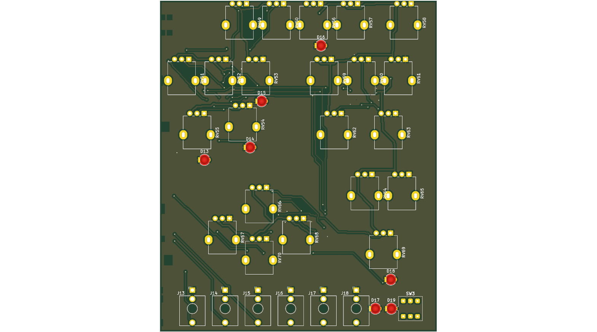
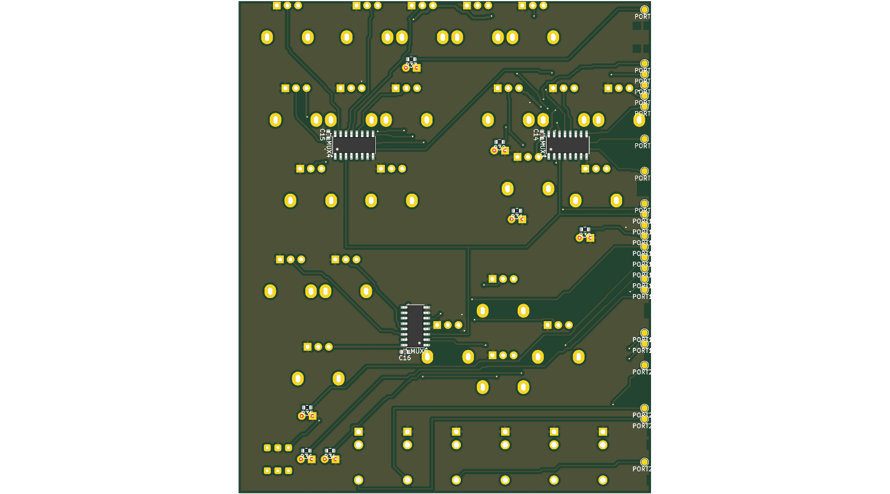

# Rev A routing spike (P4a)

Spec: [`../superpowers/specs/2026-09-29-rev-a-p4a-routing-spike-design.md`](../superpowers/specs/2026-09-29-rev-a-p4a-routing-spike-design.md)

*Status: measuring. The recommendation is written in the last task.*

## Measurement log

Every number below was printed by the command beside it.

### Strip (Task 2)

Clean run (`KIPY` is KiCad 10.0's Python):

    KIPY hardware/reva/spike/run.py --method none --layers 2

    built the strip: 72 parts, 13 keepouts, 23 ports in 7.9 s
       keepout J12.S      x 203.00..203.96 y 106.41..108.64
       keepout J12.T      x 203.00..204.06 y 117.66..120.19
       keepout J12.TN     x 203.00..204.06 y 109.36..111.89
       keepout RV38.tab   x 203.00..203.91 y 32.18..35.82
       keepout RV40.tab   x 203.17..206.28 y 48.40..52.04
       keepout RV40.1     x 203.00..203.52 y 41.62..43.82
       keepout RV44.tab   x 203.00..204.66 y 77.18..80.82
       keepout RV48.tab   x 204.29..207.41 y 95.18..98.82
       keepout RV48.1     x 203.00..204.65 y 88.40..90.60
       keepout SW2.2      x 203.00..204.80 y 10.80..12.80
       keepout SW2.3      x 205.30..207.30 y 10.80..12.80
       keepout SW2.5      x 203.00..204.80 y 16.20..18.20
       keepout SW2.6      x 205.30..207.30 y 16.20..18.20
    wrote hardware\reva\spike\out\none-2L.kicad_pcb
        1. nets       52 nets, 0 differ from the intent node for node
        2. anchors    36 panel parts, worst 0.0000 mm off its hole (limit 0.01)
        3. decoupling 3 decouplers, worst 1.778 mm (limit 2.0)
        4. copper     gated: shorting_items 0, clearance 0, hole_clearance 0, hole_to_hole 0, tracks_crossing 0, track_dangling 0 (not gated: copper_edge_clearance 15, courtyards_overlap 6, pth_inside_courtyard 2, silk_edge_clearance 23, silk_over_copper 44, silk_overlap 20, unconnected_items 133)
        5. render     rendered none-2L-top.png, none-2L-bottom.png
    proof took 2.4 s -- GREEN

The 15 `copper_edge_clearance` are the top pot row's pins (pins north) at
y about 7.0 against the assumed edge at y 6: a finding for P4's rail zone.

Placement-stage sabotages, each `KIPY hardware/reva/spike/run.py --method none --layers 2 --sabotage <name>`,
each exit 1 (the `nets` line is followed by a per-net want/got dump, shortened here):

    --sabotage nets
    RED 1. nets       52 nets, 2 differ from the intent node for node
            SABOTAGE want [] got [('D13', '1')]
    --sabotage nets_missing
    RED 1. nets       examined 0 nets
    --sabotage anchors
    RED 2. anchors    36 panel parts, worst 0.5000 mm off its hole (limit 0.01)
            D13 sits 0.500 mm off its hole
    --sabotage anchors_missing
    RED 2. anchors    examined 0 panel parts
    --sabotage decoupling
    RED 3. decoupling 3 decouplers, worst 4.665 mm (limit 2.0)
            C14 is 4.665 mm from U_MUX3's VCC pad
    --sabotage decoupling_missing
    RED 3. decoupling examined 0 decouplers
    --sabotage copper
    RED 4. copper     gated: shorting_items 0, clearance 1, hole_clearance 0, hole_to_hole 0, tracks_crossing 0, track_dangling 1 (not gated: copper_edge_clearance 15, courtyards_overlap 6, pth_inside_courtyard 2, silk_edge_clearance 23, silk_over_copper 44, silk_overlap 20, unconnected_items 134)
            clearance: 1
            track_dangling: 1

### Locked nets (Task 3)

The three rule-bearing nets are hand-routed as data in
`hardware/reva/spike/locked.py` (all B.Cu, no vias, 0.25 mm), locked, and
checked by the new `locked` step, which runs before `copper`. Corners were
drawn against:

    KIPY hardware/reva/spike/run.py --method none --where SENSE_1
       PORT10   1   (204.500, 56.260) B.Cu
       U_MUX5   3   (255.968, 84.551) B.Cu
       U_MUX4   3   (274.767, 42.413) B.Cu
       U_MUX3   3   (224.491, 42.435) B.Cu
       port: PORT10
    KIPY hardware/reva/spike/run.py --method none --where OUT_L
       PORT21   1   (204.500, 101.980) B.Cu
       J17      T   (260.300, 118.920) F.Cu/B.Cu
       port: PORT21
    KIPY hardware/reva/spike/run.py --method none --where OUT_R
       PORT22   1   (204.500, 104.520) B.Cu
       J18      T   (271.800, 118.920) F.Cu/B.Cu
       port: PORT22

Clean run:

    KIPY hardware/reva/spike/run.py --method none --layers 2

    built the strip: 72 parts, 13 keepouts, 23 ports in 8.2 s
    locked 14 items on SENSE_1, OUT_L, OUT_R
    (13 keepout lines as above)
    wrote hardware\reva\spike\out\none-2L.kicad_pcb
        1. nets       52 nets, 0 differ from the intent node for node
        2. anchors    36 panel parts, worst 0.0000 mm off its hole (limit 0.01)
        3. decoupling 3 decouplers, worst 1.778 mm (limit 2.0)
        4. locked     14 locked segments unchanged on SENSE_1, OUT_L, OUT_R
        5. copper     gated: shorting_items 0, clearance 0, hole_clearance 0, hole_to_hole 0, tracks_crossing 0, track_dangling 0 (not gated: copper_edge_clearance 15, courtyards_overlap 6, pth_inside_courtyard 2, silk_edge_clearance 23, silk_over_copper 44, silk_overlap 20, unconnected_items 128)
        6. render     rendered none-2L-top.png, none-2L-bottom.png
    proof took 2.6 s -- GREEN

Segments per net, read back from the saved and reloaded board (every one
still on its own net and locked, so no corner touches a foreign pad):
SENSE_1 7, OUT_L 3, OUT_R 4. `unconnected_items` drops from 133 to 128 --
the 3 SENSE_1 connections plus one each for OUT_L and OUT_R; the report
names none of the three nets as unconnected.

One topology fact the routes had to respect: the port column puts OUT_L
(y 101.98) above OUT_R (y 104.52), while the jacks put OUT_L's tip (J17)
west of OUT_R's (J18). Two tracks with that terminal order cannot both
leave their tips northward without crossing, so OUT_R leaves J18 southward
and passes under J17's tip along y 121.0 (0.875 mm from the outline; the
board's edge rule is 0.5 and `copper_edge_clearance` stays at 15).

Locked-step sabotages, each exit 1:

    KIPY hardware/reva/spike/run.py --method none --layers 2 --sabotage locked
    RED 4. locked     14 locked segments unchanged on SENSE_1, OUT_L, OUT_R
            moved or added: ('SENSE_1', 'B.Cu', 246.0, 84.551, 256.468, 84.551, 0.25)
            gone: ('SENSE_1', 'B.Cu', 246.0, 84.551, 255.968, 84.551, 0.25)
    KIPY hardware/reva/spike/run.py --method none --layers 2 --sabotage locked_missing
    RED 4. locked     examined 0 locked segments

The `locked` sabotage moves a segment end 0.5 mm inside U_MUX5's COM pad,
so only `locked` turns red (`copper` stays green). With the new step
`copper` is step 5; re-run of the Task 2 sabotage:

    KIPY hardware/reva/spike/run.py --method none --layers 2 --sabotage copper
    RED 5. copper     gated: shorting_items 0, clearance 1, hole_clearance 0, hole_to_hole 0, tracks_crossing 0, track_dangling 1 (not gated: copper_edge_clearance 15, courtyards_overlap 6, pth_inside_courtyard 2, silk_edge_clearance 23, silk_over_copper 44, silk_overlap 20, unconnected_items 129)

`ratsnest` and `audio_missing` are proven on the first routed board
(Task 6).

### Freerouting (Task 4)

**Install.** Bastian approved both downloads. Both live outside the repo in
`%LOCALAPPDATA%\fireflow-tools\`: `freerouting.jar` = freerouting-2.4.1.jar
(64,076,787 bytes, github.com/freerouting/freerouting release v2.4.1,
published 2026-09-03) and `jre/` = Eclipse Temurin
OpenJDK25U-jre_x64_windows_hotspot_25.0.4.1_1.zip (58,475,080 bytes).
Freerouting 2.4 requires Java 25.

    "$LOCALAPPDATA/fireflow-tools/jre/bin/java.exe" -version
    openjdk version "25.0.4.1" 2026-08-18 LTS
    OpenJDK Runtime Environment Temurin-25.0.4.1+1 (build 25.0.4.1+1-LTS)

    "$LOCALAPPDATA/fireflow-tools/jre/bin/java.exe" -jar "$LOCALAPPDATA/fireflow-tools/freerouting.jar" -l en -help
    USAGE
      freerouting [PARAMETERS]
    PARAMETERS
      -de <design.dsn>          Load the Specctra .dsn file
      -di <design_directory>    Set the default folder used by open-design dialogs
      -dr <design_rules_file>   Read routing rules from a .rules file
      -do <output_file>         Save the board (.dsn), session (.ses), or
                                Autodesk Fusion script (.scr) at the end
      -mp <number_of_passes>    Set the maximum number of auto-routing passes to perform
      -l  <language>            "en" for English, "de" for German, or "zh" for Simplified
                                Chinese; otherwise, use the system default. English is
                                used by default for unsupported languages.
      -mt <number_of_threads>   Set the thread-pool size for route optimization. The
                                default is one fewer than the number of logical
                                processors in the system.
      -us <updating_strategy>   Greedy, Global, or Hybrid. Set the board update strategy
                                for route optimization. The default is greedy. When
                                Hybrid is selected, use the "hr" option to specify the
                                hybrid ratio.
      -hr <m:n>                 Set the hybrid ratio in the format of
                                #_global_optimal_passes:#_prioritized_passes. The
                                default is 1:1. This option is effective only when the
                                Hybrid strategy is selected.
      -is <selection_strategy>  Sequential, random, or prioritized. Set the item-selection
                                strategy for route optimization. The default is
                                prioritized, which selects items based on scores
                                calculated during the previous round.
      -h                        Display this help

(Two-column layout condensed here; the wording is Freerouting's.) `-help`
does not list `-da`, `-inc` or `--gui.enabled=false`. The jar's argument
parser (`app/freerouting/settings/GlobalSettings.class`, string constants
read with a zipfile script) accepts `-de -di -do -drc -dr -mp -mt -oit -us
-is -hr -l -dl -da -host -inc -dct -ll`, `--help`, `--compare-boards=`,
and a generic `--<section>.<key>=<value>` form (plus `FREEROUTING__*`
environment variables) over the `freerouting.json` settings tree. The
probe runs below are the authority for what each spelling does.

**What the switches do (probed).** Every routing run's own log section
(`%LOCALAPPDATA%\freerouting\logs\freerouting.log`, appended per run, DEBUG
level) was checked:

- `-da`: every run logs `DEBUG  Analytics are disabled` right after the
  startup banner, before the board loads (29 of 29 runs). The probe aborts
  any run whose log lacks that line. `-da` is per run only:
  `%APPDATA%\freerouting\freerouting.json` (created by the first `-help`
  call) still reads `"allow_telemetry": true` and `"disable_analytics": false`
  after all runs and was not rewritten by them.
- `--gui.enabled=false`: headless. rc 0, about 2.1 s per run on the probe
  board (`fr1`: banner 16:03:00.5, output saved 16:03:02.6) and no window.
  `grep -c` over the shared log after all runs: 30 banners (1 `-help` + 29
  runs), 29 `Analytics are disabled`, 29 version checks, 1 `Screen:` line
  -- the `-help` call's (`Screen: 3440x1440, 96 DPI`), none from a run.
- `-mp 20` / `-mt 1`: logged as `Applied CLI router setting:
  router.max_passes = 20` / `router.max_threads = 1`.
- `-inc Other`: accepted, no error, **no effect**. On `nk.dsn` (below) the
  SES with `-inc Other` is byte-identical to the one without it, and net B
  (class `Other`) is routed in both. `--router.ignore_net_classes=Other`
  is logged as `Applied CLI router setting: router.ignore_net_classes =
  Other` and is equally byte-identical. In the jar, `ignoreNetClasses` is
  consumed only by `gui/board/GuiManager`, i.e. not in a headless run.
- `-l en`: switches the help and GUI language, but **also moved the log
  file** to `<cwd>\en\freerouting.log` (startup log: `log file :
  C:\Users\bernd\Documents\AI\FireFlow\en\freerouting.log`). The stray
  folder was deleted; `-l` is not part of `FR_ARGS`.
- Not switchable, found in the run logs: every routing run makes a version
  check (`DEBUG  No new version available. Current version is up to date:
  v2.4.1`); the jar's `util/VersionChecker` requests
  `https://api.github.com/repos/freerouting/freerouting/releases/latest`
  with the User-Agent `Freerouting-Version-Checker`. No setting for it was
  found in the jar's settings classes. It is not the analytics client.
- The two `-help` calls (one by the controller, one here) ran without
  `-da`; their logs contain neither `Analytics are disabled` nor a version
  check line, so whether they sent anything cannot be told from the log.

**Probe board.** `probe_fr.py` (scratchpad; the brief's skeleton plus
logging), under `KIPY`: 40 x 20 mm, 2 layers, SMD test-point pads. Nets A
(5,10)-(35,10) and B (20,3)-(20,17) must cross; net L (5,15)-(35,15) is
drawn on F.Cu and B.Cu and locked; a keepout covers x 26..30, y 0..12 on
both layers; classes `Sig` = {A}, `Other` = {B}.

    KIPY $S/probe_fr.py
    export True
    resolution line: ['(resolution um 10)']
    fix wires in DSN: 2 keepouts: 2
    class lines: ['(class kicad_default L', '(class Sig A', '(class Other B']
    RUN java.exe -jar freerouting.jar -de fr.dsn -do fr1.ses --gui.enabled=false -da -mp 20 -mt 1
    freerouting rc 0 ses written True
       | DEBUG  Analytics are disabled
       | INFO   ... Auto-routing stage completed: started with 2 unrouted nets, completed in 0.50 seconds, final score: 666.65 (1 unrouted and 0 violations)
    RUN ... -do fr2.ses ... (same)
    two runs byte-identical: True
    import True
    locked geometry unchanged: True
    still locked after import: True count 2
    tracks starting inside the keepout: 0
    unconnected after import: 2
    RUN java.exe -jar freerouting.jar -de fr-cc.dsn -do fr-cc.ses --gui.enabled=false -da -mp 20 -mt 1
    class_class SES written: True
    RUN java.exe -jar freerouting.jar -de fr.dsn -do fr-inc.ses --gui.enabled=false -da -mp 20 -mt 1 -inc Other
    -inc Other: SES mentions net B wires: 1 net A: 0

- Units: `(resolution um 10)`, so the brief's `3000` means 3 mm. (Freerouting's
  own DEBUG lines label its board units wrongly -- `DSN=250.0 -> board=2500
  (0.0625 mm)` -- but the SES writes width `2500` at `resolution um 10`, i.e.
  0.25 mm.)
- Locked tracks: the SES carries **no** wire of net L at all. They survive
  because KiCad's import keeps locked tracks: the same board with L
  *unlocked* before the import (`probe_fr6.py`) prints `L tracks before
  import: 2 ... L tracks after import: 0`. So locking before the DSN export
  is what protects them, and after the import they are still locked.
- `unconnected after import: 2` = net A (unrouted, below) plus the probe
  board's own artefact: L's B.Cu copy touches no pad (SMD pads, F.Cu), so
  it is an island. Before any import the same board counts 3 (A, B, and
  that island); `kicad-cli` DRC on the imported board: `track_dangling 1`
  (L on B.Cu), `unconnected_items 2`, pads of net A only.

**Surprise: net A is never routed on the brief's board.** Freerouting
reports `1 unrouted` (A) in every run with the keepout and L's locked
F.Cu wire at y 15, although a 2.9 mm corridor (y 12..14.875) is free.
DSN text variants (`probe_fr2.py`, `probe_fr3.py`), wires per net in the
SES:

    variant                                   unrouted  wires
    as exported (keepout y<=12, L F+B)          1       B 3
    keepout removed ("nk")                      0       A 3, B 3
    net B removed, keepout kept                 1       (none)
    keepout y<=11 / y<=10.5                     1       B 3
    keepout y<=9 (A's straight line is free)    0       A 3, B 3
    keepout on F.Cu only                        0       A 3, B 3 (A under it on B.Cu)
    L wires removed                             0       A 3, B 1, L 1 (A at y 12.34 on B.Cu)
    L wires not fixed / type protect            1       B 3, L 1 / L 2
    L on B.Cu only                              0       A 3, B 1, L 2
    L on F.Cu only                              1       B 3
    L only x 5..20 / only x 20..35              0       A 3, B 3, L 2
    L moved to y 17 / y 18.5                    1 / 0   A 1, L 2 (1 violation) / A 3, B 2, L 2

So with L's full-length F.Cu wire in place, A cannot detour around the
keepout even with 4 mm of room (keepout to y 10.5), and without L it takes
that corridor at once. Mechanism not established. For Task 7: Freerouting
can leave a connection unrouted where the grid router would see room, when
a keepout and a fixed wire bound the same corridor.

**Determinism.** `nk.dsn` (both nets routed): two runs with `-mt 1`
byte-identical (`True`); two runs *without* `-mt` (default thread pool, 31
here) also byte-identical (`True`). On this small board the thread count
did not break determinism; `-mt 1` stays in `FR_ARGS` anyway.

**Leftover vias.** Freerouting keeps the vias of its fanout stage even when
both sides of the via end up on F.Cu: `nk1.ses` imported gives
`via_dangling 2` (A at (5.902, 9.098) and (33.728, 10.000)), and `par.ses`
(below) has 4 vias with every wire on F.Cu. Task 7 should expect
`via_dangling` warnings on imported boards.

**class_class.** On the brief's board A is unrouted, so no A-B distance
exists there (`fr-routed`: A 0 segments, B 7). On `nk.dsn` Freerouting's
own spacing is already large (`min A-B centreline distance: 5.206 mm on
F.Cu` without the rule, `6.107 mm` with it), so a 3 mm rule shows nothing
there. `probe_fr4.py` moves the pads (DSN text, no keepout) so the natural
routes run 2.5 mm apart -- A (5,6)-(35,6), B (12,8.5)-(28,8.5):

    KIPY $S/probe_fr4.py
    RUN java.exe -jar freerouting.jar -de par.dsn -do par.ses --gui.enabled=false -da -mp 20 -mt 1
       | INFO   ... final score: 999.98 (0 unrouted and 0 violations)
      par: min A-B track centreline 0.685 mm -> edge-to-edge 0.435 mm (9 same-layer pairs)
      par: min track-edge to other-net pad-edge 0.720 mm
    RUN java.exe -jar freerouting.jar -de parcc.dsn -do parcc.ses --gui.enabled=false -da -mp 20 -mt 1
       | INFO   ... final score: 999.98 (0 unrouted and 0 violations)
      parcc: min A-B track centreline 3.908 mm -> edge-to-edge 3.658 mm (6 same-layer pairs)
      parcc: min track-edge to other-net pad-edge 3.033 mm

With the rule A dips to y 4.592 around B's pads and track; without it A and
B run 0.435 mm apart edge to edge. The rule
`(class_class (classes Sig Other) (rule (clearance 3000)))`, inserted as the
first child of `(network`, is honoured as an edge-to-edge clearance that
covers pads as well as tracks.

**For Task 7:**

1. `FR_ARGS` = `["--gui.enabled=false", "-da", "-mp", "20", "-mt", "1"]`,
   after `-jar freerouting.jar -de <in.dsn> -do <out.ses>`; no `-l`, no
   `-inc` (it does nothing headless). Verify `Analytics are disabled` in the
   run's log section each time.
2. No `lock_tracks()` after the import: locked tracks come back unchanged
   and still locked. Locking *before* the export is mandatory -- an
   unlocked track that is not in the SES is deleted by the import.
3. Deterministic: two `-mt 1` runs gave byte-identical SES files (also two
   runs without `-mt` on this board).
4. `class_class` is honoured: A-B edge-to-edge 0.435 mm without it, 3.658 mm
   (tracks) and 3.033 mm (track to pad) with a 3 mm rule.

### Our own router, 2 layers (Task 6)

`hardware/reva/spike/own.py` feeds the strip to `hardware/gen/route.py`
(PITCH 0.2, VIA_RADIUS 0.3, VIA_COST 8.0, MAX_ITERS 30, default `run()`
parameters, the router's own span order); `run.finish()` records the
unrouted count, adds the GND fill on F.Cu and B.Cu and fills. Before the
first run `via_dangling` joined the gated classes in `proof.py` (Freerouting
leaves dangling fanout vias, Task 4; gated for both methods).

    KIPY hardware/reva/spike/run.py --method own --layers 2

| run | change | seconds | failed | conflicts | iterations | vias | length mm | unrouted before fill | gated reds |
|---|---|---|---|---|---|---|---|---|---|
| 1 | none (first complete run) | 14.2 | 0 | 0 | 6 | 74 | 2682.9 | 0 | none |

Every gated step was green on the first run, so the budget stopped there:
run 1 is the method's result. The router's own check (`conflicts 0`,
`failed []`) printed before the proof; the full proof takes 3.1 s, well
under the 30 s that would call for a separate partial checker. Final run:

    own router: {'nets': 49, 'failed': [], 'conflicts': 0, 'iterations': 6, 'vias': 74, 'length_mm': 2682.9, 'seconds': 14.2}
    unrouted before fill: 0
    wrote hardware\reva\spike\out\own-2L.kicad_pcb
        1. nets       52 nets, 0 differ from the intent node for node
        2. anchors    36 panel parts, worst 0.0000 mm off its hole (limit 0.01)
        3. decoupling 3 decouplers, worst 1.778 mm (limit 2.0)
        4. locked     14 locked segments unchanged on SENSE_1, OUT_L, OUT_R
        5. copper     gated: shorting_items 0, clearance 0, hole_clearance 0, hole_to_hole 0, tracks_crossing 0, track_dangling 0, via_dangling 0 (not gated: copper_edge_clearance 15, courtyards_overlap 6, items_not_allowed 1, pth_inside_courtyard 2, silk_edge_clearance 23, silk_over_copper 44, silk_overlap 20, starved_thermal 8)
        6. ratsnest   unconnected: 0 before fill, 0 live, 0 kicad-cli
        7. audio      nearest LED track to audio: 2.71 mm (OUT_L to LED16; coupon rule 10.0, not gated)
        8. render     rendered own-2L-top.png, own-2L-bottom.png
    proof took 3.1 s -- GREEN

**The ungated `items_not_allowed 1` is a real defect.** The DRC report
names `Track [MOD2_B] on F.Cu` at (213.1, 112.3), inside the F.Cu rule area
(no tracks, no vias) that the PJ398SM footprint carries itself: J13's is
x 212.80..215.81, y 112.50..115.50, and each of the six jacks has one
(probe `probe_ruleareas.py`, scratchpad). `own.py` feeds the strip's own
keepouts to the router but not the footprints' rule areas. A probe outside
the budget (`probe_fp_ruleareas.py`, scratchpad: `own.route_strip` patched
to add the six as netless obstacles, then `run.main()`) printed the same
`own router:` numbers (74 vias, 2682.9 mm), `copper` without
`items_not_allowed`, and GREEN; MOD2_B then runs at x 212.30 instead of
213.10. Not adopted: the obstacle set is not among the budget's allowed
changes, and `items_not_allowed` is not gated.

**Routed-stage sabotages** (`--sabotage <name>` on the same configuration):

    --sabotage ratsnest
        6. ratsnest   unconnected: 0 before fill, 0 live, 0 kicad-cli
    proof took 3.0 s -- GREEN          (exit 0)
    --sabotage audio_missing
    RED 7. audio      examined 7 audio and 0 LED segments
    proof took 3.0 s -- RED            (exit 1)

**The `ratsnest` RED is vacuous on this board.** The sabotage deletes the
first candidate track, which here is a 0.102 mm pad-centre stub,
`PITCH_B B.Cu (248.800,118.920)-(248.900,118.900)`, lying entirely inside
J16.T's 2.13 mm pad, so nothing disconnects. Probe
(`probe_sab_ratsnest.py`, scratchpad): 712 candidates, 255 of them shorter
than 0.3 mm; unconnected after deleting the first candidate 0, after also
deleting the longest (`LED15 B.Cu (222.500,19.700)-(258.500,19.700)`,
36.0 mm) 1. The step itself can go red; the sabotage picks a segment whose
removal cannot. `ratsnest` was green on the unsabotaged run, so the RED
still has to be proven -- on the Freerouting board in Task 7, or with a
sabotage that picks a segment whose deletion raises the live count.

**Reproducibility.** Two runs of the final configuration, the first board
copied to the scratchpad in between:

    cmp "$S/own-2L-first.kicad_pcb" hardware/reva/spike/out/own-2L.kicad_pcb
    (no output, exit 0)

**The pictures** (`routing-spike/own-2L-top.png`,
`routing-spike/own-2L-bottom.png`): the top side carries a vertical bundle of
four to six tracks down the middle of the strip between the upper pot rows
and a set of long 45-degree runs in the lower-left quarter between the
jacks and the RV67/RV70 pots; the bottom side fans out into the port column
along the west edge, with a diagonal bundle running from east of U_MUX5
towards the lower ports and long straight runs such as LED15's 36 mm along
y 19.7. Nothing hugs the outline except the port approaches and the locked
OUT_R run; as far as the render's resolution shows, the vias sit singly at
the ends of top-side runs, not in clusters.

